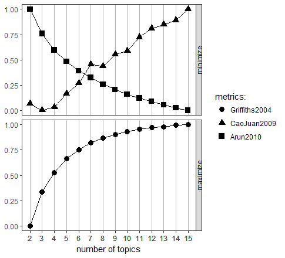
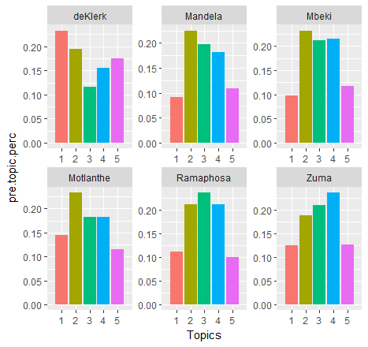

```{r setup, include=FALSE}

##---------------------------------##
## ADD ANY LIBRARIES USED HERE
##---------------------------------##

knitr::opts_chunk$set(
  echo = FALSE, eval = TRUE, warning = FALSE
)

suppressPackageStartupMessages({
  require(tidyverse)
  require(tidytext)
  require(stringr)
  require(lubridate)
  require(knitr)
  require(wordcloud)
  require(wordcloud2)    #wordcloud
  require(kableExtra)    #tables
  require(formattable)   #coloured cell in a table
  require(keras)
  require(psych)          #For Cohen's Kappa psych::cohen.kappa()
  require(ggrepel) 
})

##---------------------------------##
## DATA LOADED SO NO NEED TO RELOAD
##---------------------------------##

load("input_data.RData")
load("sentence_data.RData")
load("balanced_train_data.RData")
load("audrey/sentiment_all.Rdata")
load("vanessa/topic_matrix.RData")
```


# Description of the Problem

We were given 30 State of the Nation (SONA) speeches from 1994 to 2018 to analyse. The specific objectives are to: 

 1. Infer sentiment and changes in sentiment over time  
 2. Describe the topics that emerge  
 3. Predict the President from a given sentence of text  
 4. Evaluate an out of sample performance of the predictions  


# Approach

We collaborated using the following GitHub location: **https://github.com/samperumal/dsi-assign2**. 

We initially split the work as follows and each of us created a folder with our names to push our work to for others to view:  

 * Neural Net - Sam and Merve
 * Bag of Words - Merve
 * Topic Modelling - Vanessa
 * Sentiment Analysis - Audrey

We presented our work to each other and made suggestions for improvement. Before diving into any prediction, we felt it was important to do an Exploratory Data Analysis (EDA) to get a sense of the high level overview of the dataset. This was done by Audrey.

The initial results from the Neural Net gave a 65% accuracy on the validation set. In order to  achieve a higher accuracy, we attempted to feed the results of the Topic Modelling and Sentiment Analysis into the Neural Net. Thus, we needed to understand from each other what the output of these 2 methods were and the input required by the neural net to get the data into a useable format which took some discussion and a few iterations.

Given the low accuracy of the neural net (NN), we tried a Convolutional Neural Net (CNN). Sam got the initial model working. Merve made improvements. Vanessa tuned the hyperparamters. The result is discussed in this document and is a collaborative effort.

The CNN did not provide an improvement over the initial NN, and as a result we tried a Recurrent Neural Net (RNN). This takes ina sequence of data and gives importance to the order of the words in order to make a prediction.

# Data Preparation

Initially we each performed our own import of the data, splitting out the year and president and tokenisation but we realised there was duplication of effort here and different naming conventions which made it difficult to collaborate and use each other's output. In addition, Sam noticed that some of the data was not loaded due to special characters. Sentences were not being tokenised correctly for various reasons and he became responsible for performing the data clean up (preprocessing) and outputting a .RData file that everyone could use to run our work. 

The data as provided consisted of 30 text files, with filenames encoding the president's name, the year of the speech, and whether it was pre/post an election (which is absent in non-election years). In working through the files, we discovered that two files were identical which was corrected in the data source with replacement. Additionally, in reading the files, we also identified 3 files that had one or more bytes which caused issues with the standard R file IO routines. Specifically 1 file had a leading Byte-Order-Mark (BOM) which is unique to windows operating system files, and 2 other files had invalid unicode characters, which suggests a text-to-speech processing application was used and experienced either transmissionor storage errors. In all the cases the offending characters were simply removed from the input files. 

Having fixed basic read issues, we then examined the content of each file and the simplistic tokenisation achieved by applying *unnest_tokens* to the raw lines read in from the files. Several issues were uncovered, and in each case a **regular expression** was created to correct the issue in the raw read lines:

 * There are multiple characters which are not handled correctly by the default parser, particularly where unicode characters are substituted for standard ASCII characters or are erroneously inserted as part of the text capture. This range of characters were simply removed from the text: **\"“”%’‘[]()–+¬>-**.
 
 * Forward-slashes were converted to a space, to handle both options (hot/cold) and numeric ranges (1998/99).
 
 * Bullet-pointed lists are interpreted as a single, exceptionally long sentence by default. We chose to split this up into a lead-in sentence terminated by a colon, and a list of sentences starting after the bullet point character (\*).
 
 * Numbers (both with and without thousand separator characters) and currency values with leading currency symbols (R/$) were removed.
 
 * Specific punctuation (ellipsis, colon, semi-colon) was considered equivalent to a sentence separator and converted to a full stop: **:;…¦...**.
 
 * Full stops separated by only whitespace were considered redundancy and collapsed to a single whitespace character.
  
 * All contiguous whitespace was collapsed to a single whitespace character.
 
 * The *unnest_tokens* function relies on each new sentence starting with a capital letter. After the above fixes, it was was therefore necessary to capitalise every character after full stop, to ensure it is recognised as the start of a new sentence.
 
Having fixed the text to allow correct sentence tokenisation, and applied the *unnest_tokens* function, we then determined a unique ID for each sentence by applying a hash digest function to the sentence text. This unique ID allowed everyone to work on the same data with confidence, and enabled us to detect 72 sentences that appeared identically in at least 2 speeches. As these duplicates would potentially bias the analysis and training, all instances of duplicates were removed from the dataset.
  
One final note is that each speech starts with a very similar boiler plate referencing various attendees to the SONA in a single, run-on sentence. We believe this header does not add significantly to the content of the speech, and so we excluded all instances across all speeches.

```{r fig.cap, eval=TRUE}
comparison_data_set = bind_rows(
  input_data$sentences %>% mutate(processing = +1), 
  input_data$unfiltered_sentences %>% mutate(processing = -1)
) %>% 
  mutate(year2 = paste(year, ifelse(election == "post", " post", ""), sep = ""))

grouped_data_set = comparison_data_set %>% 
  group_by(president, year2, processing) %>%
  summarise(count = n()) %>%
  select(President = president, year = year2, processing, count) %>% 
  mutate(signed_count = processing * count) 

changed_data_set = grouped_data_set %>%
  group_by(President, year) %>%
  summarise(change = max(signed_count) + min(signed_count))
  
changed_data_set %>% ggplot() + geom_col(aes(x = year, y = change, fill = President)) + theme(axis.text.x=element_text(angle=90,hjust=1,vjust=0.5)) + ylab("Number of sentences") + xlab("Year") + ggtitle("Change in number of sentences per president after filtering.")
```

The figure above shows the change in number of sentences per president after filtering. On the whole there are more sentences per president, with only a single reduction. Additionally, the highest increases are associated with the files where read-errors prevented us from previously reading the entire file. This change is equally evident in the boxplots below, which show the change in distribution per president of words and characters per sentence. 

```{r eval=TRUE}
merged_sentences = bind_rows(input_data$sentences %>% mutate(filter = "Filtered"), input_data$unfiltered_sentences %>% mutate(filter = "Unfiltered"))

merged_sentences %>% mutate(slen = str_length(sentence)) %>% ggplot(aes(x = president, y = slen, colour = president)) + geom_boxplot() + facet_grid(cols = vars(filter)) + xlab("President") + ylab("Sentence length in characters")+ theme(axis.text.x=element_text(angle=90,hjust=1,vjust=0.5)) + ggtitle("Variance in sentence length in words per President") 
```

```{r eval=TRUE}
merged_words = bind_rows(input_data$words %>% mutate(filter = "Filtered"), input_data$unfiltered_words %>% mutate(filter = "Unfiltered"))

merged_words %>% group_by(president, filter, id) %>% summarise(n = n()) %>% select(president, filter, n) %>% ggplot(aes(x = president, y = n, colour = president)) + geom_boxplot() + facet_grid(cols = vars(filter)) + xlab("President") + ylab("Sentence length in words") + theme(axis.text.x=element_text(angle=90,hjust=1,vjust=0.5))  + ggtitle("Variance in sentence length in characters per President")
```

Overall there is a much tighter grouping of sentences, with less variation and more conistent lengths, which is useful for techniques which depend on equal length inputs, such as some of the Neural Networks. The final histogram below shows the histogram of number of sentences per year/president after filtering, which still bears the same basic shape as before filtering, but with a better profile.

```{r eval=TRUE}
grouped_data_set %>% 
  filter(processing == 1) %>% 
  ggplot() + geom_col(aes(x = year, y = count, fill = President)) + theme(axis.text.x=element_text(angle = 90,hjust = 1,vjust = 0.5)) + ylab("Number of sentences") + xlab("Year") + theme(axis.text.x=element_text(angle=90,hjust=1,vjust=0.5))  + ggtitle("Total number of sentences per President per year")

```

## Data Split and Sampling

For all group work, we separated our full dataset into a random sampling of 80% training and 20% validation data, which was saved into a common .RData file. This ensured that there would be consistency across the data we were working on so that we could use each others work and compare results consistently.

The graphs above make it clear that our data is also very unbalanced. In an attempt to correct for this, we applied supersampling with replacement to the training dataset to ensure an equal number of sentences per president. Training was attempted using both balanced and unbalanced training data, but it did not appear to make much difference. Balancing was conducted on the training dataset only to ensure there are no duplicates in the validation set that might skew validation error.


# Overview of the dataset

Each president has made a certain number of SONA speeches, depending on their term in office and whether there was 1 speech that year or 2 in the year of an election (pre and post election). Since the data is dependent on their term in the office it is unbalanced. Sentence counts per president after cleaning the data is :

```{r eval=TRUE}
paste0("President sentence counts:")
(table(input_data$sentences$president))
paste0("Baseline_accuracies")
(baseline_accuracies = table(input_data$sentences$president)*100/sum(table(input_data$sentences$president)))

#Since the baseline accuracies as given above, as very unbalanced, it is expected that the majority classes will be predicted over the minority.
```
Let us understand the number of words used by each President and how this varies across each SONA speech. 

## Average number of words used per President

We need to create a metric called "avg_words" which is simply the total number of words across all SONA speeches made by a particular president, divided by the total number of SONA speeches that president made.  

```{r descPres, eval=TRUE}

# sentence tokenization
tidy_sona_sentences <- input_data$sentences

# word tokenization
tidy_sona_words <- input_data$words %>% 
  filter(!word %in% stop_words$word, str_detect(word, "[a-z]"))  # remove stop words

# bigram tokenization
bigrams <- tidy_sona_sentences %>% 
  unnest_tokens(bigram, sentence, token = "ngrams", n = 2)
# separate the bigrams 
bigrams_separated <- bigrams %>%
  separate(bigram, c("word1", "word2"), sep = " ")
# remove stop words
bigrams_filtered <- bigrams_separated %>%
  filter(!word1 %in% stop_words$word) %>%
  filter(!word2 %in% stop_words$word)
# join up the bigrams again
tidy_sona_bigrams <- bigrams_filtered %>%
  unite(bigram, word1, word2, sep = " ")

# speeches
speech_count <- tidy_sona_words %>%
  group_by(year, president) %>%
  count() %>% 
  group_by(president) %>% 
  summarise(num_speeches = n())

# avg words per president
avg_word_count <- tidy_sona_words %>%
  group_by(president) %>% 
  summarise(num_words = n()) %>% 
  left_join(speech_count) %>% 
  mutate(avg_words = round((num_words/num_speeches),0)) %>% 
  arrange(desc(avg_words))

# plot avg words per president
avg_word_count %>%
  ungroup(avg_words, president) %>%
  mutate(avg_words = color_bar("lightblue")(avg_words)) %>%
  kable("html", escape = FALSE, align = "l", caption = "Average number of words used per President") %>%
  kable_styling(bootstrap_options = 
                  c("striped", "condensed", "bordered"), 
                  full_width = FALSE)

```
  
On average, Mbeki used the most words in his SONA speeches, followed by Motlanthe and de Klerk used the least. Mandela and Zuma are ranked in the middle of their peers. The current president (Ramaphosa) used fewer words than all of his post 1994 peers.  

## Number of words used per SONA

```{r descSONA, eval=TRUE}

# per SONA
word_count <- tidy_sona_words %>%
  group_by(president, year, election) %>%
  summarise(num_words = n()) %>%
  arrange(desc(num_words)) 

# plot words per SONA
word_count %>%
  ggplot(aes(x = as.numeric(year), y = num_words, colour = president)) +
  geom_point() + 
  geom_smooth(method = "loess", aes(colour = president))

```
  
Of the 3 presidents that have made more than 1 SONA speech, Mbeki used more words on average than both Mandela and Zuma and the variance in the number of words used per SONA speech is also higher for Mbeki. In 2004, which was an election year, the average number of words Mbeki used was lower in both his pre- and post-election speeches. Towards the end of his term, his average number of words also dropped off. The data suggests that perhaps Mbeki's average number of words is correlated with his confidence in being re-elected President.  

## Common words used across all SONA speeches

```{r}

# word cloud for words
word_count <- tidy_sona_words %>%
  count(word, sort = TRUE)

wordcloud2(word_count[1:300, ], size = .6, color='random-dark')

```
  
## Common bigrams used across all SONA speeches

```{r}

# word cloud for bigrams
bigram_count <- tidy_sona_bigrams %>%
  count(bigram, sort = TRUE)

wordcloud2(bigram_count[1:300, ], size = .8, color='random-dark')

```

## Lexical Diversity per President

Lexical diversity refers to the number of unique words used in each SONA.

```{r diversity, eval=TRUE, warning=FALSE}

# word tokenization
diversity_per_year <- input_data$words %>%   # don't remove stop words this time
  group_by(president, year) %>% 
  summarise(diversity = n_distinct(word)) %>% 
  arrange(desc(diversity))

diversity_per_year %>%
  ggplot(aes(x = as.numeric(year), y = diversity, colour = president)) +
  geom_point(color = "steelblue",
               alpha = .7,               # transparency
               size = 3,                 # point size
               position = "jitter") +    # point overlap
  geom_smooth(method = "loess", aes(colour = president)) +
  ggtitle("Lexical Diversity per President") +
  xlab("year") +
  ylab("")

```
  
The number of unique words per SONA ranges from about 700 for de Klerk in 1994 to over 2500 with Mandela in his post election speech of 1999. Mbeki's post election speech of 2004 and Zuma's post election speech of 2014 reached close to the 2500 mark.

It's interesting that whilst the trend in the number of unique words used increased for Mandela, Mbeki and Zuma both show a upward trend in the lead up to the election year, followed by a downward trend after elections, despite nearing the 2500 unique words mark in their post election speeches.

If we exclude the post election speeches, the number of unique words used by Mbeki during his term from 2000 to 2008 averages just under 2000 whereas the number of unique words used by Zuma during his term from 2009 to 2017 averages just over 1500.  

## Lexical Density per President

Lexical density refers to the number of unique words used in each SONA divided by the total number of words and a high value is an indicator of word repitition.  

```{r density, eval=TRUE}

# word tokenization
density_per_year <- input_data$words %>%   # don't remove stop words this time
  group_by(president, year) %>% 
  summarise(density = n_distinct(word) / n()) %>% 
  arrange(desc(density))

density_per_year %>%
  ggplot(aes(x = as.numeric(year), y = density, colour = president)) +
  geom_point(color = "steelblue",
               alpha = .7,               # transparency
               size = 3,                 # point size
               position = "jitter") +    # point overlap
  geom_smooth(method = "loess", aes(colour = president)) +
  ggtitle("Lexical Density per President") +
  xlab("year") +
  ylab("")

```
  
De Klerk repeated over 30% of his words in his 1994 pre election SONA speech. On average, Mandela repeated about 25% of words in each of his SONA speeches and this reduced to about 20% in the post election speech of 1999. Mbeki's repitition rate was about 23% and this reduced to 20% in the post election speech of 2004. Zuma's repitition rate is over 30% with the exception of his post election speech of 2014 at about 23%.  

# Sentiment Analysis

## Bing Lexicon Results

The "bing" lexicon encodes words as either "positive" or "negative". However, not all words used in the SONA speeches are in the lexicon so we need to adjust for this.
  
### Sentiment per President
  
Let's understand how many "positive" and "negative" words are used by each president across all their SONA speeches and create a metric called "sentiment" which is simply the total number of positive words minus the total number of negative words. We then adjust for the total number of words used from the lexicon in the "sentiment_score" metric.  
  
```{r bing, eval=TRUE}

# average sentiment per president
avg_sentiment <- tidy_sona_words %>%
  inner_join(get_sentiments("bing")) %>%
  group_by(president) %>% 
  count(sentiment) %>%
  spread(sentiment, n, fill = 0) %>%
  mutate(sentiment = positive - negative,
         sentiment_score = round( (sentiment / (positive + negative) * 100), 2)) %>% 
  arrange(desc(sentiment_score))

# plot avg words per president
avg_sentiment %>%
  ungroup(sentiment_score, president) %>%
  mutate(sentiment_score = color_bar("lightblue")(sentiment_score)) %>%
  kable("html", escape = FALSE, align = "l", caption = "Sentiment Score per President") %>%
  kable_styling(bootstrap_options = 
                  c("striped", "condensed", "bordered"), 
                  full_width = FALSE)

```
   
Of the 3 presidents that have made more than 1 SONA speech, Zuma has the highest sentiment score, followed by Mbeki and then Mandela. Zuma's sentiment score is nearly double Mandela's. It's interesting that the current President, Ramaphosa, has the second highest sentiment score, not far behind Zuma and only slightly ahead of Mbeki.


  
### What are the 10 positive words most frequently used by each president?
  
```{r  eval=TRUE}

positive_words <- tidy_sona_words %>%
  group_by(president) %>% 
  inner_join(get_sentiments("bing")) %>% 
  filter(sentiment == "positive") %>%
  count(word) %>%
  arrange(desc(n)) %>%
  group_by(president) %>% 
  slice(seq_len(10)) %>%
  ungroup() %>%
  arrange(president, n) %>%
  mutate(row = row_number())

positive_words %>%
  ggplot(aes(x = row, n, fill = president)) +
    geom_col(show.legend = NULL) +
    labs(x = NULL, y = "Number of times positive word is used") + 
    ggtitle("Positive Words most used by each President") +
    facet_wrap(~president, 
               ncol = 3, nrow = 3, 
               scales = "free") +
    scale_x_continuous( 
      breaks = positive_words$row, 
      labels = positive_words$word) +
    coord_flip()

```
  
De Klerk's most used words were "freedom", "peaceful" and "support" and at least 2 of these 3 come up in all the president's most used words. Mandela's most used words include "progress", "improve", "reconciliation" and "commitment" which are all words indicating repair and a move towards something better. Mbeki uses many of the same words but also introduces "empowerment" which is a word carried through by Zuma and Ramaphosa, and "success" which is carried through by Zuma. This is likely due to the fact that Black Economic Empowerment (BEE) was introduced under Mbeki and was a policy carried through by Zuma and Ramaphosa. In addition, these words suggest progress in the move towards repair or something better, first spoken about by Mandela. Ramaphosa also introduces the words "confidence", "effectively", "enhance" and "efficient", which are words commonly seen in a business context and have not shown up in any other SA president's top 10 most frequently used words in a SONA since 1994.  

### Which of the positive words most frequently used are common across presidents?
  
```{r eval=TRUE}

total_speeches <- tidy_sona_words %>% 
                 group_by(president) %>% 
                 summarise(total = n())

tidy_sona_words %>%
  inner_join(get_sentiments("bing")) %>% 
  filter(sentiment == "positive") %>%
  group_by(president) %>%
  count(word, sort = TRUE) %>%
  left_join(total_speeches) %>% 
  mutate(freq = n/total) %>% 
  filter(rank(desc(freq)) <= 10) %>%
  ggplot(aes(reorder(word,freq), freq, fill = president)) + 
  geom_col() + 
  coord_flip() + 
  xlab("") +
  facet_grid(.~ president) +
  ggtitle("Positive Words most used across Presidents") +
  theme(axis.text.x=element_text(size=6, angle = 90))

```
  
Common positive words across post 1994 presidents include: "freedom", "regard", "support", "improve" and "progress". Words introduced by Mandela and unique to his speeches are: "restructuring", "reconciliation", "committment", "contribution" and "succeed". Mbeki introduces the words "empowerment", "comprehensive", "integrated" and "improving" into the top words used and this is unique to his speeches. Zuma uses the words "success", "reform" and "pleased" frequently and other presidents do not. Ramaphosa introduces the words "significant", "productive", "confidence" and "effectively" which have not yet been seen in the any other SA president's top 10 most frequently used words in a SONA since 1994.  

### What are the 10 negative words most used by each president?

```{r negative, eval=TRUE}

negative_words <- tidy_sona_words %>%
  group_by(president) %>% 
  inner_join(get_sentiments("bing")) %>% 
  filter(sentiment == "negative") %>%
  count(word) %>%
  arrange(desc(n)) %>%
  group_by(president) %>% 
  slice(seq_len(10)) %>%
  ungroup() %>%
  arrange(president, n) %>%
  mutate(row = row_number())

negative_words %>%
  ggplot(aes(x = row, n, fill = president)) +
    geom_col(show.legend = NULL) +
    labs(x = NULL, y = "Number of times negative word is used") + 
    ggtitle("Negative Words most used by each President") +
    facet_wrap(~president, 
               ncol = 3, nrow = 3, 
               scales = "free") +
    scale_x_continuous( 
      breaks = negative_words$row, 
      labels = negative_words$word) +
    coord_flip()

```
  
Common negative words pre 1994 include: "concerns"/"concern"/"concerned", "unconstitutional", "illusion", "hopeless", "disagree", "deprive", "conflict", and "boycott".

Common negative words post 1994 include: "corruption", "crime"/"criminal", "poverty"/"poor", "inequality", "issue"/"issues" and "crisis".

A negative word introduced by and unique to Mandela's top 10 is "struggle". 
Mbeki is the only president with the word "racism" in his top 10 negative words.
Motlanthe has "conflict" in his top 10 which no other president does. Zuma has "rail" which likely refers to the railway system and does have negative connotations for South Africa. Both Zuma and Ramaphosa use the word "difficult" a lot. Ramaphosa introduces the word "expropriation" into the top 10 for the first time amongst his peers.

### How many of the negative words most used were used by each president?
    
```{r  eval=TRUE}

tidy_sona_words %>%
  inner_join(get_sentiments("bing")) %>% 
  filter(sentiment == "negative") %>%
  group_by(president) %>%
  count(word, sort = TRUE) %>%
  left_join(total_speeches) %>% 
  mutate(freq = n/total) %>% 
  filter(rank(desc(freq)) <= 10) %>%
  ggplot(aes(reorder(word,freq), freq, fill = president)) + 
  geom_col() + 
  coord_flip() + 
  xlab("") +
  facet_grid(.~ president) +
  ggtitle("Negative Words most used across Presidents") +
  theme(axis.text.x=element_text(size=6, angle = 90))
  
```
  
The interpretation is much the same as before. Note the clear separation between the top 10 negative words used pre and post 1994 elections, indicative of the pre and post apartheid regimes.

### What proportion of words used are positive vs negative?

```{r eval=TRUE}

sentiments_per_year <- tidy_sona_words %>%
  inner_join(get_sentiments("bing")) %>%
  group_by(year, sentiment) %>%
  summarize(n = n()) 

sentiments_relative <- sentiments_per_year %>% 
  left_join(sentiments_per_year %>% 
            group_by(year) %>% 
            summarise(total = sum(n))) %>%
  mutate(freq = n/total) 

# plot proportion of positive and negative words used
ggplot(filter(sentiments_relative), aes(x = year, y = freq, fill = sentiment)) +
  geom_col() + coord_flip() + ggtitle("% of Negative and Positive Words per Year") +
  geom_hline(yintercept = 0.60) +
  geom_hline(yintercept = 0.70)

```
  
The 2 vertical black lines are drawn at 60% and 70% positivity rates. In the majority of years, SONA speeches fall within this range of positivity however a there are a few more negative speeches in earlier years and a few more positive speeches in later years.

## Change in Sentiment over time

```{r eval=TRUE}

sentiments_relative %>%
  ggplot(aes(x = as.numeric(year), y = freq, colour = sentiment)) +
  geom_point() + geom_line() +
  geom_smooth(method = "loess", aes(colour = sentiment)) +
  ggtitle("Trends in Positive and Negative Sentiment over time") +
  scale_x_discrete(name ="year", 
                    limits=c(1994,1999,2004,2009,2014))

```
  
The trend appears to be more positive and less negative over time but how can we be sure?

We will test whether negative sentiment is increasing or decreasing, then we will test whether positive sentment is increasing or decreasing . We will use a Binomial model because the frequencies are between 0 and 1. Finally, we will test whether average sentiment is increasing or decreasing using a linear model.  

### Is negative sentiment increasing over time?

```{r modelneg, eval=TRUE}

model_neg <- glm( freq ~ as.numeric(year), data = subset(sentiments_relative, sentiment == "negative"), family = "binomial")
summary(model_neg)

```

The slope is negative but the beta of the year variable is not significant so we cannot conclude that negative sentiment is decreasing over time.  

### Is postive sentiment increasing over time?

```{r modelpos, eval=TRUE}

model_pos <- glm( freq ~ as.numeric(year), data = subset(sentiments_relative, sentiment == "positive"), family = "binomial")
summary(model_pos)

```

The slope is positive but the beta of the year variable is not significant so we cannot conclude that positive sentiment is increasing over time.  

### Is average sentiment increasing over time?

```{r modelavg, eval=TRUE}

sentiments_per_year <- tidy_sona_words %>%
  inner_join(get_sentiments("bing")) %>%
  group_by(year, president) %>% 
  count(sentiment) %>%
  spread(key = sentiment, value = n) %>% 
  mutate(sentiment = positive - negative,
         avg_sentiment = sentiment / (positive + negative) * 100)

model_avg <- glm( avg_sentiment ~ as.numeric(year), data = sentiments_per_year, family = "gaussian")
summary(model_avg)

```
  
The slope is positive and the beta of the year variable is significant at 1% so we can conclude that average sentiment is increasing over time.  

But we need to be cautious with this interpretation because what could actually be going on here is that the "bing"" lexicon has more than double the number of negative words than positive words so this could be influencing the results and SONA speeches may in fact be more positive than they appear to be.

```{r eval=TRUE}

table(get_sentiments('bing')$sentiment)

```

### Distribution of "bing" Sentiment per President

```{r eval=TRUE}

# per year, per president
sentiments_per_year <- tidy_sona_words %>%
  inner_join(get_sentiments("bing")) %>%
  group_by(year, president) %>% 
  count(sentiment) %>%
  spread(key = sentiment, value = n) %>% 
  mutate(sentiment = positive - negative,
         avg_sentiment = sentiment / (positive + negative) * 100)

# plot of sentiment by president
ggplot(sentiments_per_year, aes(x = president, y = avg_sentiment, colour = president)) + 
  geom_boxplot() + # draw a boxplot for each president
  ggtitle("Boxplots of bing Sentiment per President")

```

Apart from the last 2 presidents, Ramaphosa and Zuma, the presidents are in time order. We can see that other than Motlanthe, the trend is an increasing average sentiment over time but at a decreasing rate. The interquartile range of Mbeki is smaller than Zuma's which is smaller than Mandela's.

### Change in "bing" Sentiment over time

```{r eval=TRUE}

# per year
sentiments_per_year <- tidy_sona_words %>%
  inner_join(get_sentiments("bing")) %>%
  group_by(year, president) %>% 
  count(sentiment) %>%
  spread(key = sentiment, value = n) %>% 
  mutate(sentiment = positive - negative,
         avg_sentiment = sentiment / (positive + negative) * 100)

sentiments_per_year %>%
  ggplot(aes(x = as.numeric(year), y = avg_sentiment, colour = president)) +
  geom_point() + 
  geom_smooth(method = "loess", aes(colour = president)) +
  ggtitle("Change in bing Sentiment over time") +
  scale_x_discrete(name ="year", 
                    limits=c(1994,1999,2004,2009,2014))

```
  
Average sentiment is the proportion of positive words out of all the words in the "bing" lexicon. Mandela shows a very erratic average sentiment, ranging from 0 to over 25. Mbeki and Zuma's average sentiment mostly ranges between 25 and 50, with the exception of a few such as 2000, 2008, 2012, 2017. 

## Sentiment Analysis using "afinn" lexicon 

Afinn lexicon measures positivity on a scale from -5 negative to +5 positive.

```{r afinn, eval=TRUE}

tidy_sona_words %>%
  inner_join(get_sentiments("afinn")) %>%
  count(score) %>% 
  mutate(weighted_score = score * n) %>% 
  ungroup(weighted_score) %>%
  mutate(weighted_score = color_bar("lightblue")(weighted_score),
         n = color_bar("lightblue")(n)) %>%
  kable("html", escape = FALSE, align = "r", caption = "afinn Sentiment") %>%
  kable_styling(bootstrap_options = 
                  c("striped", "condensed", "bordered"), 
                  full_width = FALSE)

```
  
The most number of words are scored positive 2, followed by positive 1. This becomes even more pronounced when scores are multiplied by counts to get weighted scores. The distribution of all "afinn" words is as follows:

```{r eval=TRUE}

table(get_sentiments('afinn')$score)

```
  
Words with a score of -2 dominate the lexicon, followed by words with a score of 2. We found a relatively high number of words with a score of 2 in this analysis but it is unlikely to only be a result of its prevalence in the lexicon and we can conclude that it is probably an accurate assessment of the sentiment that prevails in the text.  

### Distribution of "afinn" Sentiment per President

```{r eval=TRUE}

# per year, per president
sentiments_per_year <- tidy_sona_words %>%
  inner_join(get_sentiments("afinn")) %>%
  group_by(year, president) %>% 
  count(score) %>%
  mutate(score = ifelse(is.na(score), 0, score),
         total_words = sum(n),
         afinn_sentiment = sum(score * n),   # weighted score
         afinn_sentiment_perc = round((afinn_sentiment/total_words*100),2)) %>% 
         # afinn sentiment as a percentage of total words in the sentence
  spread(key = score, value = n, fill = 0)

# plot of sentiment by president
ggplot(sentiments_per_year, aes(x = president, y = afinn_sentiment_perc, colour = president)) +   geom_boxplot() + # draw a boxplot for each president
  ggtitle("Boxplots of afinn sentiment per President")

```

The interpretation is much the same as with the "bing" lexicon in that the trend is an increasing average sentiment over time however Zuma's median sentiment is lower than the general trend.

### Change in "afinn" Sentiment over time

```{r eval=TRUE}

sentiments_per_year %>%
  ggplot(aes(x = as.numeric(year), y = afinn_sentiment, colour = president)) +
  geom_point() + 
  geom_smooth(method = "loess", aes(colour = president)) +
  ggtitle("Change in afinn Sentiment over time") +
  scale_x_discrete(name ="year", 
                    limits=c(1994,1999,2004,2009,2014))

```
  
Mandela and Zuma show a wave-like pattern of sentiment. Mbeki shows an increasing and then decreasing pattern.

## Sentiment Analysis using "nrc" lexicon 

The nrc lexicon infers emotion with certain words.

```{r eval=TRUE}

president_total <- tidy_sona_words %>% 
  group_by(president) %>% 
  count() %>% 
  rename(total = n)

# nrc sentiment per president
tidy_sona_words %>%
  inner_join(get_sentiments("nrc")) %>%
  group_by(president, sentiment) %>% 
  summarise(word_count = n()) %>%
  left_join(president_total) %>% 
  mutate(word_perc = round((word_count/total*100),2)) %>% 
  ungroup() %>%
  mutate(sentiment = reorder(sentiment, word_count)) %>% 
  ggplot(aes(sentiment, word_perc, fill = president)) +
  facet_wrap(~president, 
           ncol = 3, nrow = 3, 
           scales = "free") +
  geom_col() +
  guides(fill = FALSE) +                       # turn off the legend
  labs(x = NULL, y = "Relative Word Count") +
  scale_y_continuous(limits = c(0, 20)) +      # hard code the axis limit
  ggtitle("NRC Sentiment per President") +
  coord_flip()

```
  
The distribution of all "nrc" words is given by:

```{r eval=TRUE}

table(get_sentiments('nrc')$sentiment)

```
  
Words can be assigned more than 1 sentiment but we do not expect as many words to come up under "anticipation", "joy" or "surprise" given the relatively lower counts in the lexicon. So "anticipation" has a surprisingly high relative count across all presidents.  

Given that "positive" sentiment is the most frequent classification in the "nrc" lexicon, it is not surprising that it comes out as the most frequently assigned classification across all presidents. The distributions across the various sentiments are very similar for all presidents so this lexicon does not provide any insights about specific presidents.

```{r eval=TRUE}

nrc_sentiment <- tidy_sona_words %>%
  inner_join(get_sentiments("nrc")) %>%
  group_by(sentiment) %>% 
  count(word, sort = TRUE) %>%
  arrange(desc(n)) %>%
  slice(seq_len(8)) %>% #consider top_n() from dplyr also
  ungroup() 

nrc_sentiment %>% 
  # set `y = 1` to just plot one variable and use word as the label
  ggplot(aes(word, 1, label = word, fill = sentiment )) +
  # we want the words, not the points
  geom_point(color = "transparent") +
  # make sure the labels don't overlap
  geom_label_repel(force = 1,nudge_y = .5,  
                   direction = "y",
                   box.padding = 0.04,
                   segment.color = "transparent",
                   size = 3) +
  facet_grid(~sentiment) +
  theme(axis.text.y = element_blank(), axis.text.x = element_blank(),
        axis.title.x = element_text(size = 6),legend.position="none",
        panel.grid = element_blank(), panel.background = element_blank(),
        panel.border = element_rect("lightgray", fill = NA),
        strip.text.x = element_text(size = 9)) +
  xlab(NULL) + ylab(NULL) +
  ggtitle("NRC Sentiment") +
  coord_flip()

```

   
The negative most used words which are also associated with the "anger", "disgust", fear" and "sadness" emotions are: "violence", "struggle" and "poverty". 

The positive most used words which are also associated with the "anticipation", "joy" and surprise" emotions are: "youth", "public" and "progress".

The most usedwords that evoke the "trust" emotion are: "system", "president", "parliament" and "nation".  

# Topic Modelling

An effective topic model can summarise the ideas and concepts within a document - this can be used in various ways.  A user can understand the main themes within the corpus of documents and draw conclusions from these from analysis of these topics or they can use the information as type of dimensional reduction and feed these topics into different supervised or unsupervised algorithms.

In this project, our group has used topic modelling to better understand the common topics that come up over the SONA speeches, how these are related to different presidents and speeches and how they change over time.  In addition, the probability that a sentence belongs to a certain topic was used in an attempt to classify which sentence was said by which president (see Section XX)

## Data

The data used in this section is the clean and processed data as described in Section X.  The resulting sentence data has been used and dissected further without consideration to train and validation unless otherwise stated. 


### Methodology

The following methodology was followed:

1. Each sentence was tokenised into "bigrams", stop words removed and a document-term matrix set up
    Bigrams were chosen over individual words as they provided more context and meaning.
2. An optimisation technique was used to help determine the number of topics that are covered in the corpus of documents and this optimisation was validated on a hold out sample.
3. Latent Dirichlet allocation was used to determine the probability of bigrams belong to certain topics and the probability that sentences belonged to topics.
4. Text mining methods were deployed to extract insight into the different topics
5. The probability of sentences to each topics were then passed through to a neural network.


#### Step One: Tokenisation, Remove Stop words and Document Term Matrix


```{r, echo = FALSE, warning = FALSE, eval=FALSE}
#Load data
load("../input_data.RData")
#Get sentence data
inputdata <- input_data$sentences

#Getting Bigrams out
tidy_sona3 = input_data$sentences %>%  unnest_tokens(bigram, sentence, token = "ngrams", n  = 2)

#Get stop words
data("stop_words")

# separate the bigrams 
tidy_sona3_sep <- tidy_sona3 %>%
  separate(bigram, c("word1", "word2"), sep = " ")

# remove stop words
bigrams_filtered <- tidy_sona3_sep %>%
  filter(!word1 %in% stop_words$word) %>%
  filter(!word2 %in% stop_words$word)

# join up the bigrams again
bigrams_united <- bigrams_filtered %>%
  unite(bigram, word1, word2, sep = " ")


#Lets see what the most commonly used terms are
bigrams_count_plot <- bigrams_united %>%
  group_by(bigram) %>%
  summarise(count_bigram = n()) %>%
  select(bigram, count_bigram) %>%
  arrange(desc(count_bigram))
#plot these top terms
bigrams_count_plot %>%
  top_n(20, count_bigram) %>%
  ungroup() %>%
  arrange(desc(count_bigram)) %>%
ggplot(aes(bigram, count_bigram)) +
  geom_col(show.legend = FALSE , color = "blue", fill = "blue") +
  coord_flip()


```


After tokenisation and removal of stop words, the top 20 most used terms across all of the SONA speeches are displayed.  Unsurprisingly, "South Africa" is the most used term followed closely by "South African" and "South Africans" and "Local Government".  These terms do not add to our understanding of the topics and tend to confuse the topic modelling going forward.  The removal of the terms allows for a cleaner interpretation.  "Public service is then the most used term.


```{r, echo = FALSE, warning = FALSE, eval=FALSE}

#create term count to feed into DTM
bigrams_count <- bigrams_united %>%
  group_by(id, bigram) %>%
  summarise(count_bigram = n()) %>%
  select(id, bigram, count_bigram) %>%
  arrange(desc(count_bigram))


#remove the terms from the data set
bigrams_count <- bigrams_count %>% 
    filter (bigram != "south africa") %>%
    filter (bigram != "south african") %>%
    filter (bigram != "south africans") %>%
      filter (bigram != "local government")


#create document term matrix (DTM)
dtm_grams <- bigrams_count %>% 
cast_dtm(id, bigram, count_bigram)


```


### Step 2: Optimisation of k - the number of topics.

A pre-requisite of topic modelling is knowing the number of topics that each corpus may contain (i.e. the latent factor k) In some cases, this may be a fair assumption but without reading though each speech, how  could one know how many different topics have been articulated in the SONA's?  Luckily, Murzintcev Nikita has published an R- package (ldatuning) that helps to optimise the number of topics (k) over three different measures. The measures used to determine the number of topics, are discussed in an RPubs paper which can found here: [link](http://www.rpubs.com/MNidhi/NumberoftopicsLDA) and the following optimisation largely follows the accompanying vignette: [link] (https://cran.r-project.org/web/packages/ldatuning/vignettes/topics.html)

The following extract from the RPub paper gives a brief explanation of the methods used to optimise for k:

*Extract from RPubs*

"*Arun2010: The measure is computed in terms of symmetric KL-Divergence of salient distributions that are derived from these matrix factor and is observed that the divergence values are higher for non-optimal number of topics (maximize)*

*CaoJuan2009: method of adaptively selecting the best LDA model based on density.(minimize)*

*Griffths: To evaluate the consequences of changing the number of topics T, used the Gibbs sampling algorithm to obtain samples from the posterior distribution over z at several choices of T(minimize)*"


In addition to this, Nikita considers how the number of k may change over a validation or hold out sample.  His term for this is*"perplexity"* which he defines as *"[it] measures the log-likelihood of a held-out test set; Perplexity is a measurement of how well a probability distribution or probability model predicts a sample"*

Below is an attempt to optimise for k and to check that the choice of k holds over an unseen data set.

```{r, echo = FALSE, warning = FALSE, eval=FALSE}
#sepertate the bigrams into a train and test set
#ungroup the daat
bigrams_sample <- bigrams_count %>% ungroup()
#number of rows
n =nrow(bigrams_sample)
#sample from data
index = sample(1:nrow(bigrams_sample), round(n*0.8,0))

#seperate into test and train
train_data <- bigrams_sample[index,]
test_data <- bigrams_sample[-index,]


#put train and test into the DTM matrix formats
dtm_train <- train_data %>% 
cast_dtm(id, bigram, count_bigram)

dtm_test <- test_data %>% 
cast_dtm(id, bigram, count_bigram)

#optimise for k
result <- FindTopicsNumber(
  dtm_train,
  topics = seq(from = 2, to = 15, by = 1),
  metrics = c("Griffiths2004", "CaoJuan2009", "Arun2010"),
  method = "Gibbs",
  control = list(seed = 77),
  mc.cores = 2L,
  verbose = FALSE
)
#plot the measures
FindTopicsNumber_plot(result)

```



From the above plot, the marginal benefit from adding another topic, stops at around 8-10 topics.  In order to test this, the *"perplexity"* over a test sample for the document term matrix can be checked.

```{r, echo = FALSE, warning = FALSE, eval=FALSE}
#initalise loop
perplexity_df <- data.frame(train=numeric(), test=numeric())
#set patamaets
topics <- c(2:15)
burnin = 100
iter = 1000
keep = 50

#loop to test over train and test
set.seed(12345)
for (i in topics){
 
  fitted <- LDA(dtm_train, k = i, method = "Gibbs",
                control = list(burnin = burnin, iter = iter, keep = keep) )
  perplexity_df[i,1] <- perplexity(fitted, newdata = dtm_train)
  perplexity_df[i,2]  <- perplexity(fitted, newdata = dtm_test) 
}


##plotting the perplexity of both train and test

g <- ggplot(data=perplexity_df, aes(x= as.numeric(row.names(perplexity_df)))) + labs(y="Perplexity",x="Number of topics") + ggtitle("Perplexity of hold out and training data") + scale_x_discrete(limits = topics)

g <- g + geom_line(aes(y=test), colour="red")
g <- g + geom_line(aes(y=train), colour="blue")
g 
```


As more topics are used, the perplexity of the training sample does decrease but that of the test sample increases from around 11 topic.  The perplexity of the test sample seems to be minimised at around 8 topics.  

The evidence from these two plots suggest that the optimal number topics sits at around 8 topics.  


### Step 3: Latent Dirichlet allocation 


For this assignment, Latent Dirichlet allocation (LDA) was used for the topic modelling.  Other methods, such as a Latent Semantic Analysis (LSA) or Probabilistic Latent Semantic Analysis (pLSA) could have been used but LDA is useful due to the fact that it allows:
      1. Each document within the corpus to be a mixture of topics
      2. Each topic to be a mixture of bigrams
      3. The topics are assumed to be drawn from Dirichlet distribution (i.e. not k different distributions as with pLSA) so there are less parameters to estimate and no need to estimate the probability that the corpus generates a specific document.
      
      
      
```{r, echo = FALSE, warning = FALSE, eval=FALSE}
##chose 5 topics
#set seed
set.seed(1234)
#run teh LDA with full dtm matrix
topics_lda <- LDA(dtm_grams, k = 5, control = list(seed = 1234))

#get ther bigrams out from model
term <- as.character(topics_lda@terms)
#bind the betas and the topics together
speech_topics <- as.tibble(cbind(term, t(topics_lda@beta)))
#lables for the data
colnames(speech_topics) <- c("Bigrams", "topic1","topic2","topic3","topic4","topic5")

#gathers into tidy format 
#note a term should appear more than once.
speech_topics <- speech_topics %>% 
  gather(topic1
         , topic2
         , topic3
         , topic4
         , topic5
         , key = "topic", value = "beta")


##mutate the betas
speech_topics <- speech_topics %>%
  mutate(beta = as.numeric(beta)) %>%
  mutate(beta = exp(beta))


```


      
### Step 4: Extracting insights  


      
      
#### Understanding the topics via the bigrams      
      
The beta matrix produced gives the probability of the topic producing that bigram (i.e. that the phrase is in reference to that topic.)  From this measure, one can get a sense of what the character of the topic is. By using the most popular phrases in each topic, understanding of the flavour of each topic emerges.  However, it must be kept in mind that terms can belong to *more than one topic* so applying some logic to get a theme or flavour should be done liberally.


##### Topic One

From the display of popular terms, it can be determined that the topic one has a vague connection to "job creation" - this is the most common terms but is supported by other terms that have a high probability of being generated by this topic such as: 
+ "world cup"
+ "national youth"
+ "infrastructure development"

These concepts all support the idea of the job creation as each of these will generate jobs for the country. But there is some noise in the topic for "address terms" i.e. honourable speaker or honourable chairperson.  "Nelson Mandela" and "President Mandela" crop up too which suggests that alongside the job creation theme, there exists some of what can be termed "terms of endearment" 

```{r, echo = FALSE, warning = FALSE, eval=FALSE}

###Topic 1

#filter for topic one
top_terms.1 <- speech_topics %>%
  filter(topic == "topic1") %>%
  group_by(topic) %>%
  top_n(30, beta) %>%
  ungroup() %>%
  arrange(topic, -beta)
##plot the most popluar terms
plot_topic_1 <- top_terms.1 %>%
  mutate(Bigrams = reorder(Bigrams, beta)) %>%
  ggplot(aes(Bigrams, beta, fill = factor(topic))) +
  geom_col(show.legend = FALSE) +
  facet_wrap(~ topic, scales = "free") +
  coord_flip()

#set up for word cloud
maxs <- max((top_terms.1$beta*100))
mins <- min(top_terms.1$beta*100)


word_count.1 <- top_terms.1 %>%
  mutate(freq = scale(beta*100, center = mins, scale = maxs - mins)) %>%
  select(Bigrams, freq)


#word cloud
set.seed(12345)
wordcloud.1 <- wordcloud2(word_count.1, color = "random-dark", size = .4)

par(mfrow= c(2,1))
plot_topic_1
set.seed(12345)
wordcloud.1


```


##### Topic Two


As with the previous topic, there is some random "terms of endearment" in this topic as well (i.e. "madam speaker") but it is not as evident as in the first topic. This is to be expected as bigrams can be generated by more than one topic as each topic is a mixture of bigrams!  The next four terms sums out the main themes for this topic:
+ "Economic Empowerment"
+ "Black Economic"
+ "Justice System"
+ "Criminal Justice"

In summary, this topic can be summed as "Economy/ Criminal and Justice System"


```{r, echo = FALSE, warning = FALSE, eval=FALSE}


###Topic 2

#filter for topic two
top_terms.2 <- speech_topics %>%
  filter(topic == "topic2") %>%
  group_by(topic) %>%
  top_n(30, beta) %>%
  ungroup() %>%
  arrange(topic, -beta)
##plot the most popluar terms
plot_topic_2 <- top_terms.2 %>%
  mutate(Bigrams = reorder(Bigrams, beta)) %>%
  ggplot(aes(Bigrams, beta, fill = factor(topic))) +
  geom_col(show.legend = FALSE) +
  facet_wrap(~ topic, scales = "free") +
  coord_flip()

#set up for word cloud
maxs <- max((top_terms.2$beta*100))
mins <- min(top_terms.2$beta*100)


word_count.2 <- top_terms.2 %>%
  mutate(freq = scale(beta*100, center = mins, scale = maxs - mins)) %>%
  select(Bigrams, freq)


#word cloud
set.seed(12345)
wordcloud.2 <- wordcloud2(word_count.2, color = "random-dark", size = .5)


par(mfrow= c(2,1))
plot_topic_2
#set.seed(12345)
wordcloud.2


```


##### Topic Three


Despite the most popular terms being "United Nation" and "private sector", there a theme that is "developing". As in development plan, resource development, national development and development programme etc.  And thus, the topic is named.      

```{r, echo = FALSE, warning = FALSE, eval=FALSE}
###Topic 3

#filter for topic three
top_terms.3 <- speech_topics %>%
  filter(topic == "topic3") %>%
  group_by(topic) %>%
  top_n(30, beta) %>%
  ungroup() %>%
  arrange(topic, -beta)
##plot the most popluar terms
plot_topic_3 <- top_terms.3 %>%
  mutate(Bigrams = reorder(Bigrams, beta)) %>%
  ggplot(aes(Bigrams, beta, fill = factor(topic))) +
  geom_col(show.legend = FALSE) +
  facet_wrap(~ topic, scales = "free") +
  coord_flip()

#set up for word cloud
maxs <- max((top_terms.3$beta*100))
mins <- min(top_terms.3$beta*100)


word_count.3 <- top_terms.3 %>%
  mutate(freq = scale(beta*100, center = mins, scale = maxs - mins)) %>%
  select(Bigrams, freq)


#word cloud
set.seed(12345)
wordcloud.3 <- wordcloud2(word_count.3, color = "random-dark", size = .3)


par(mfrow= c(2,1))
plot_topic_3
wordcloud.3


```


##### Topic 4

Once again, there is a "term of endearment" in the popular terms ("fellow south" which is assumed short for "fellow South African's" which is one of former President Zuma's favourite phrases).  With all the other terms combined, a theme of "Social Reform/ Regional and Municipal Government" takes shape.

Given that there is a possible trigram evident here, it may be worth exploring in future work.

```{r, echo = FALSE, warning = FALSE, eval=FALSE}

#filter for topic four
top_terms.4 <- speech_topics %>%
  filter(topic == "topic4") %>%
  group_by(topic) %>%
  top_n(30, beta) %>%
  ungroup() %>%
  arrange(topic, -beta)
##plot the most popluar terms
plot_topic_4 <- top_terms.4 %>%
  mutate(Bigrams = reorder(Bigrams, beta)) %>%
  ggplot(aes(Bigrams, beta, fill = factor(topic))) +
  geom_col(show.legend = FALSE) +
  facet_wrap(~ topic, scales = "free") +
  coord_flip()

#set up for word cloud
maxs <- max((top_terms.4$beta*100))
mins <- min(top_terms.4$beta*100)


word_count.4 <- top_terms.4 %>%
  mutate(freq = scale(beta*100, center = mins, scale = maxs - mins)) %>%
  select(Bigrams, freq)


#word cloud
set.seed(12345)
wordcloud.4 <- wordcloud2(word_count.4, color = "random-dark", size = .4)

par(mfrow = c(1,2))
plot_topic_4
wordcloud.4


```


##### Topic 5

"Public sector" and "private sector" are popular terms in topic 5.  After consideration of the various other terms, of which some have cross over with other topics and discussion, the eventual name for this topic became "Public Sector Entities"


```{r, echo = FALSE, warning = FALSE, eval=FALSE}

#filter for topic five
top_terms.5 <- speech_topics %>%
  filter(topic == "topic5") %>%
  group_by(topic) %>%
  top_n(30, beta) %>%
  ungroup() %>%
  arrange(topic, -beta)
##plot the most popluar terms
plot_topic_5 <- top_terms.5 %>%
  mutate(Bigrams = reorder(Bigrams, beta)) %>%
  ggplot(aes(Bigrams, beta, fill = factor(topic))) +
  geom_col(show.legend = FALSE) +
  facet_wrap(~ topic, scales = "free") +
  coord_flip()

#set up for word cloud
maxs <- max((top_terms.5$beta*100))
mins <- min(top_terms.5$beta*100)


word_count.5 <- top_terms.5 %>%
  mutate(freq = scale(beta*100, center = mins, scale = maxs - mins)) %>%
  select(Bigrams, freq)


#word cloud
set.seed(12345)
wordcloud.5 <- wordcloud2(word_count.5, color = "random-dark", size = .6)
#saveWidget(wordcloud.5,"5.html",selfcontained = F)

par(mfrow= c(2,1))
plot_topic_5
wordcloud.5


```


A different way of looking at this topic could be to investigate the biggest differential in terms between topics.  For instance, using the log(base 2) ratio between topic 1 and topic 5, shows the terms that have the widest margin between the two topic (i.e. are far more likely to be in topic 5 versus topic 1)

```{r, echo = FALSE, warning = FALSE, eval=FALSE}
#comparison of topic 1 to topic 5

small_topic <- speech_topics %>%
  filter(topic == "topic5"|topic == "topic1")


beta_spread <- small_topic %>%
  #  mutate(topic = paste0("topic", topic)) %>%
  spread(topic, beta) %>%
  filter(topic1 > .001 | topic5 > .001) %>%
  mutate(log_ratio = log2(topic5 / topic1))

beta_spread %>%
  group_by(direction = log_ratio > 0) %>%
  top_n(10, abs(log_ratio)) %>%
  ungroup() %>%
  mutate(Bigrams = reorder(Bigrams, log_ratio)) %>%
  ggplot(aes(Bigrams, log_ratio)) +
  geom_col() +
  labs(y = "Log2 ratio of beta in topic 5 / topic 1") +
  coord_flip()


```


For instance, "social programmes", "human fulfilment", "rights commission" are all generated in significantly larger proportions by Topic 5 compared to Topic 1 while "national social", "training colleagues" and "sector unions" all exist with in Topic 1.

Given the naming of Topic 5 as "Public Sector Entities" and Topic 1 as "Job Creation/Terms of Endearment" these terms do seem to be grouped in line with expectation.


#### Understanding the mixture of topics within the sentence    

The LDA model allows each of the sentence to be represented as a mixture of topics.  The gamma matrix shows the document-topic probability for each sentence. i.e. the probability that each sentence is drawn from that topic. For instance, the follow sentence sampled from random shows that it has a 0.905% probability of being drawn from topic 4 based on the use of the bigrams within it.  The sentence appears to be talking about the water and the infrastructure around it.  The label for topic of was "Social Reform/ Regional and Municipal Government" and this statement seems to be somewhat relevant to it.


```{r, echo = FALSE, warning = FALSE, eval=FALSE}
#get the gamma matrix and change to double and rename
speech_documents <- cbind(as.character(topics_lda@documents), tidy(topics_lda@gamma), stringsAsFactors = FALSE)
colnames(speech_documents) <- c("id","X1","X2","X3","X4","X5")
speech_documents$X1 <- as.double(speech_documents$X1)
speech_documents$X1 <- as.double(speech_documents$X2)
speech_documents$X1 <- as.double(speech_documents$X3)
speech_documents$X1 <- as.double(speech_documents$X4)
speech_documents$X1 <- as.double(speech_documents$X5)

#eft join to orginal data
#left join as stop words makes less items
topic_matrix <- left_join(inputdata,  speech_documents, by = "id")

##make the NA )'s for Merv's purposes
topic_matrix <- topic_matrix %>%
  mutate(X1 = ifelse(is.na(X1), 0, X1)) %>%
  mutate(X2 = ifelse(is.na(X1), 0, X2)) %>%
  mutate(X3 = ifelse(is.na(X1), 0, X3)) %>%
  mutate(X4 = ifelse(is.na(X1), 0, X4)) %>%
  mutate(X5 = ifelse(is.na(X1), 0, X5)) 
  

#save this for Merve
#save(topic_matrix, file = "vanessa/topic_matrix.RData")
#save(sample, file = "./sample_sentence.RData")

#random sample of sentence
set.seed(12345)
sample <- as.tibble(sample_n(topic_matrix, size = 1)) %>% select (- election, -id)
#save(sample, file = "sample_sentence.RData")
```


```{r, echo = FALSE, warning = FALSE, eval=TRUE}
load("sample_sentence.RData")
kable(sample, caption = "Sample sentence showing topic probabilities")

```

Using this method, the sentences can be roughly classified to a topic based on the probabilities (i.e. classify the sentence by the topic with the highest probability) and further analysis can be conducted. 

(Note: the which.is.max breaks ties at random so where a sentence has equal probabilities, is will decide at random to which topic it gets assigned)


```{r, echo = FALSE, warning = FALSE, eval=FALSE}
##find the topic per sentence
data.max <- as.data.frame(topic_matrix[,6:10])
data.max <- apply(topic_matrix[,6:10],1,which.is.max) 
data.max[sapply(data.max, is.null)] <- NA
data.max <- unlist(as.numeric(as.character(data.max)))

#bind the max topic
topic_matrix <- cbind(topic_matrix, data.max)
#View(head(topic_matrix))

##gather data
topic_matrix_long <- topic_matrix %>%
  select(id, president, sentence, X1,X2,X3,X4,X5, data.max) %>%
  gather(X1, X2,X3,X4,X5, key = "topic", value = "gamma")

#pivot for graph
totals <- topic_matrix_long %>% count(president)


data.graph <- topic_matrix_long %>%
  group_by(president, data.max) %>%
  summarise(count_topic = n())

data.graph <- left_join(data.graph, totals, by = "president") %>% mutate(pre.topic.perc = count_topic/n)

#graph
  data.graph %>%
    mutate(term = reorder(president, pre.topic.perc * data.max)) %>%
    ggplot(aes(y= pre.topic.perc, x= data.max,  fill = factor(data.max))) +
    geom_col(show.legend = FALSE) +
    scale_x_discrete(name ="Topics", 
                     limits=c("1","2","3","4","5")) +
    facet_wrap(~ president, scales = "free") 
  


```



Consider the mixture of topics that each individual president covers during the SONA address.  Despite the imbalance in the number of sentences said by each president, there seems to be a fairly standard shape to the topics discussed. The two exceptions to this are de Klerk and Zuma. All other presidents tend to send around 10-15% on topic 1 ("Job Creation/Terms of Endearment") and the 15-20% on Topic 2 ("Economy/Criminal and Justice System"), Topic 3 ("Development") and Topic 4 ("Social Reform/Regional and Municipal Government") and the around another 10% on Topic 5 ("Public Sector Entities").  This trend means that it may be difficult for a supervised model to pick up difference in presidents based on the topic covered.  

As stated, the only two presidents where this trend differs are President de Klerk and President Zuma.  President de Klerk spend the majority of his time on Topic 1 ("Job Creation/Terms of Endearment") followed by Topic 2 ("Economy/Criminal and Justice System").  Given the context around the time period, it may be unsurprising that "terms of endearment" and "criminal and Justice systems" come up since his speech would be littered with names of people and political parties as well as talking about past injustices.

President Zuma spends the majority of his speeches on Topic 4 ("Social Reform/Regional and Municipal Government").  Once again, given context that his terms as President was marked with service delivery strikes, two major droughts over a few different regions and  discussions around and reform this may be unsurprisingly.  And in fact, when the most popular terms from topic 4 is recalled ("fellow south") is may even be predictable that this would be the most "talked about" topic for President Zuma.  What is interesting that given the attention to the issues of State Capture that characterised Zuma's presidency, his coverage of Topic 5 ("Public Sector Enterprises") is much smaller than that of his peers.


A similar analysis can be taken over time.


```{r, echo = FALSE, warning = FALSE, eval=FALSE}

##gather data
topic_matrix_year <- topic_matrix %>%
  select(id, year, sentence, X1,X2,X3,X4,X5, data.max) %>%
  gather(X1, X2,X3,X4,X5, key = "topic", value = "gamma")


#pivot for graph
totals.year <- topic_matrix_year %>% count(year)

data.graph.year <- topic_matrix_year %>%
  group_by(year, data.max) %>%
  summarise(count_topic = n())

data.graph <- left_join(data.graph.year, totals.year, by = "year") %>% 
  mutate(year.topic.perc = count_topic/n) %>%
  select (year, data.max, year.topic.perc)

#graph
data.graph %>%
    filter(data.max != "NA") %>%
    mutate(topic = data.max) %>%
    ggplot(aes(y= year.topic.perc, x= year,  colour = factor(topic))) + 
    geom_line() + geom_point() +
  scale_x_continuous(name="Year", limits=c(1994, 2018), breaks = c(1994,1998,2002,2006,2010,2014, 2018))

```


The graph shows that over time, topics 1 and 5 are the least discussed topics while topics 2,3 and 4 all get much the same airtime. There are a number of notable spikes/valleys:
+ In 1996, Topic 2 ("Economy/Crime and Justice System") spikes
  
  The 1996 SONA was a few months ahead of the introduction of the new constitution as well as at the time of the start of the Truth and Reconciliation Commission.  It could be suggested that these two ideas would drive up the topic in the SONA speech.

+ In 2005, topic 1 ("Job Creations/Terms of Endearment") dives while topic 4 ("Social Reform/Region and Municipal Government") and Topic 2 ("Economy/Criminal and Justice System") spike considerably

  Mbeki's term in presidency (1998 - 2008) was characterised by a rise in crime specifically in farm attacks as well as the HIV/AID epidemic and the start of the Black Economic Empowerment  in 2005 which could attribute the spikes and drops of topics in 2005.

+ In 2012, Topic 2 dives considerably ("Economy/Criminal and Justice System")
 
 From various media reports, Zuma's 2012 SONA speech largely covered the success of the government while skipping over future plans.  It may be a reason while Topic 4 ("Social Reform/Regional and Municipal Government") rises sharply. 

 
 
 
 
 
 
#### Step Five: Using the topic to predict the president

One of the aims behind topic modelling is to reduce the dimensions of the data to allow for other techniques to be applied.  In this instance, the aim was to reduce the SONA speeches to a collection of topics that would help predict which president was responsible for a sentence in the SONA speech.  The assumption was that each president might have a unique set of topics or mixture of topics that could characterise their particular speech.  However, there does not seem to be evidence of this.  The matrix with the probability of each sentence belonging to a topic is used in Section X and the results are discussed.

## **Neural Nets **

### **Neural Net with Bag of Words Data**

The count of each word that have been used in each sentence is what we are going to be feeding in. We need to unnest the sentence data, count each word in each sentence and spread the sentence word counts so that we have sentence id's in each row and we have each word as column id's. This is the simplest neural net model that we can try, so that was our first model.

```{r train_accuracy_wordcount_bigger, eval=FALSE}
#Unnest words and count
president_word_count = input_data$sentences %>%
  group_by(president) %>%
  unnest_tokens(word, sentence) %>%
  count(id, word, sort = TRUE) %>%
  ungroup()
  
#Spread the words
bag_of_words <- president_word_count %>% 
  select(ID = id, prez = president,  word,n) %>% 
  spread(key = word, value = n, fill = 0)

#Set training and testing sets
set.seed(321)
training_ids <- bag_of_words %>% 
  group_by(prez) %>% 
  sample_frac(0.9) %>% 
  ungroup() %>%
  select(ID)

training_sona <- bag_of_words %>% 
  right_join(training_ids, by = "ID") %>%
  select(-ID)

test_sona <- bag_of_words %>% 
  anti_join(training_ids, by = "ID") %>%
  select(-ID)
nrow(bag_of_words)

# Seperate response variable
dim(training_sona) #6626 rows 10626 cols
x_train <- as.matrix(training_sona %>% select(-prez))
x_test <- as.matrix(test_sona %>% select(-prez), ncol = 10625)

#One-hot encoding for response variable
labels_test = test_sona %>% select(prez) %>% unlist()
president_count = labels_test %>% as_tibble() %>% unique() %>% count()
response_tokenizer = text_tokenizer(num_words = president_count + 1)
response_tokenizer$fit_on_texts(labels_test)
# Extract response vector, ignoring first (empty) column
y_test = (response_tokenizer$texts_to_matrix(labels_test, mode = "binary"))[,-1]

labels_train = training_sona %>% select(prez) %>% unlist()
president_count = labels_train %>% as_tibble() %>% unique() %>% count()
response_tokenizer = text_tokenizer(num_words = president_count + 1)
response_tokenizer$fit_on_texts(labels_train)
# Extract response vector, ignoring first (empty) column
y_train = (response_tokenizer$texts_to_matrix(labels_train, mode = "binary"))[,-1]

#Create a model, define a model by sequentially adding layers.
model <- keras_model_sequential() #Creating an empty sequential model
model %>%
  layer_dense(units = 64, activation = 'relu', input_shape = ncol(x_train)) %>%
  layer_dense(units = 64, activation = 'relu', kernel_regularizer = regularizer_l2(0.01)) %>%
  layer_dense(units = 6, activation = 'softmax') %>%
  compile(
  optimizer = optimizer_rmsprop(lr = 0.003),
  loss = 'categorical_crossentropy',
  metrics = c('accuracy')
)
#See the number of parameteres
#summary(model)

#Compile and fit the model
model %>% fit(x_train, y_train, epochs = 10, batch_size = 32, validation_data = list(x_test, y_test)
) %>% plot()

#Evaluate the model
(test_accuracy_wordcount_bigger = model %>% evaluate(x_test, y_test, batch_size=32, verbose = 1)) #0.55886
(train_accuracy_wordcount_bigger = model %>% evaluate(x_train, y_train, batch_size=32, verbose = 1))
```
```{r}
load("mnn.RData")
```


This model has L2 regularization to avoid overfitting but even so it didn't help very much. The accuracy is 0.55886. The optimizer_rmsprop has learning rate 0.003. This was choosen after trying lr=c(0.001, 0.002, 0.003) To make readability easier the model with best learning rate is used. 

As we can see from the plot model overfits after the second iteration, since the loss function start increasing in value, so to avoid that let's use a smaller model with less neurons and add a dropout.
```{r table_bow, eval=FALSE}
model <- keras_model_sequential() #Creating an empty sequential model

#Define a model by sequentially adding layers. Add a simple model so it does not overfit.

model %>%
  layer_dense(units = 16, activation = 'relu', input_shape = ncol(x_train)) %>%
  layer_dropout(0.03) %>%
  layer_dense(units = 16, activation = 'relu', 
              kernel_regularizer = regularizer_l2(0.01)) %>%  #Dense layer with L2 regularizer 
  layer_dropout(0.01) %>%
  layer_dense(units = 6, activation = 'softmax') %>%       #6 neurons since we have six presidents
  compile(
  optimizer = optimizer_rmsprop(lr = 0.003),  
  loss = 'categorical_crossentropy',
  metrics = c('accuracy')
)

#See the number of parameteres:
summary(model)

model %>% fit(x_train, y_train, epochs = 10, batch_size = 32, validation_data = list(x_test, y_test)
) %>% plot()

model %>% evaluate(x_test, y_test, batch_size=32, verbose = 1) #0.5811648

#Test and Train Accuracies
(test_accuracy_wordcount_smaller = model %>% evaluate(x_test, y_test, batch_size=32, verbose = 1)) #0.5811648
#This smaller model gave a better accuracy result than the one that has no dropout 

(train_accuracy_wordcount_smaller = model %>% evaluate(x_train, y_train, batch_size=32, verbose = 1))

#Get the predictions for the model
predictions <- model %>% predict(x_test)
predictions2 = model %>% predict_classes(x_test)
range(predictions)
range(predictions2)


#Getting the max of each rows prediction and binding it on the end
pres.max <- as.data.frame(predictions)
pres.max <- apply(predictions,1,which.max) 
pres.max <- unlist(as.numeric(as.character(pres.max)))
pres.max <- cbind(predictions,pres.max )

pres.actual <- as.data.frame(y_test)
pres.actual <- apply(y_test,1,which.max) 
pres.actual = as.data.frame(pres.actual, ncol=1)

predictions_val <- cbind(test_sona, pres.actual, pres.max)
predictions_val = predictions_val %>% select(prez, pres.actual, pres.max)

#We can see each presidents' classifications individually by filtering
head(predictions_val %>% filter(prez == "Mbeki") %>% select(pres.max, pres.actual)) #President numero 1
head(predictions_val %>% filter(prez == "Zuma") %>% select(pres.max, pres.actual)) #President numero 2
head(predictions_val %>% filter(prez == "Mandela") %>% select(pres.max, pres.actual)) #President numero 3
head(predictions_val %>% filter(prez == "Motlanthe") %>% select(pres.max, pres.actual)) #President numero 4
head(predictions_val %>% filter(prez == "Ramaphosa") %>% select(pres.max, pres.actual)) #President numero 5
head(predictions_val %>% filter(prez == "deKlerk") %>% select(pres.max, pres.actual))#President numero 6

(predictions_val %>% select(prez, pres.actual) %>% unique %>% arrange(-desc(pres.actual)))


table_bow <- table(actual = predictions_val$pres.actual, pred = predictions_val$pres.max)
paste0("Accuracy rate is:" ,round((sum(diag(table_bow))/sum(table_bow)),4))
```


`r table_bow`

Accuracy rate is: `r round((sum(diag(table_bow))/sum(table_bow)),4)`.

#### **Cohen's Kappa**

Kappa value tells you how much better your classifier is performing over the performance of a classifier that simply guesses at random according to the frequency of each class.

"Cohen’s kappa is always less than or equal to 1. Values of 0 or less, indicate that the classifier is useless. There is no standardized way to interpret its values. Landis and Koch (1977) provide a way to characterize values. According to their scheme a value < 0 is indicating no agreement, 0-0.20 as slight, 0.21-0.40 as fair, 0.41-0.60 as moderate, 0.61-0.80 as substantial, and 0.81-1 as almost perfect agreement."
[Reference: Landis, J.R.; Koch, G.G. (1977). "The measurement of observer agreement for categorical data". Biometrics 33 (1): 159-174]

The Kappa value is, `r round(cohen.kappa(table_bow)[1]$kappa, 3)` and this means we are doing better than random.

The accuracy is slightly better than bigger model with no-dropouts (0.581%)
Just for the word-count model seems good enough. But this model does not consider how important each word is to its corpus. So we should consider a better model to try.

After the fourth iteration validation loss starts increasing which is a sign of overfitting. 

### **Neural Net with tf-idf Data**

TFIDF is a statisic that shows how important a word is to it's corpus. So if we are feeding NN with TFIDF we are logically expecting the results to be slightly better than the word-cout NN model. 

```{r tfidf, eval=FALSE}
tidy_sona = input_data$sentences %>%
  unnest_tokens(word, sentence, token = "words") %>% 
  select(id, word, year, president) 

sona_tdf <- tidy_sona %>%
  select(id,word) %>%
  group_by(id,word) %>%
  count() %>%  
  group_by(id) %>%
  mutate(total = sum(n)) %>%
  ungroup()

sona_tf_idf <- sona_tdf %>% 
  bind_tf_idf(word, id, n) # replace with values from tidytext

#Get presidents names where id's match
nm <- c("id", "president")
df = input_data$sentences
sona_tf_idf[nm] <- lapply(nm, function(x) df[[x]][match(sona_tf_idf$id, df$id)])


# Spreading the data

tf_idf_wide <- sona_tf_idf %>% 
  select(ID = id, prez = president, word, tf_idf) %>%  # note the change, using tf-idf
  spread(key = word, value = tf_idf, fill = 0)

#Create training anf testing set
set.seed(321)
training_ids <- tf_idf_wide %>% 
  group_by(prez) %>% 
  sample_frac(0.9) %>% 
  ungroup() %>%
  select(ID)

training_sona <- tf_idf_wide %>% 
  right_join(training_ids, by = "ID") %>%
  select(-ID)

test_sona <- tf_idf_wide %>% 
  anti_join(training_ids, by = "ID") %>%
  select(-ID)

# Seperate response variable and normalize the data
dim(training_sona) #6626 rows 10626 cols
x_train <- normalize(as.matrix(training_sona %>% select(-prez))) 
x_test <- normalize(as.matrix(test_sona %>% select(-prez)))

#One-hot encoding for response variable
labels_test = test_sona %>% select(prez) %>% unlist()
president_count = labels_test %>% as_tibble() %>% unique() %>% count()
response_tokenizer = text_tokenizer(num_words = president_count + 1)
response_tokenizer$fit_on_texts(labels_test)
# Extract response vector, ignoring first (empty) column
y_test = (response_tokenizer$texts_to_matrix(labels_test, mode = "binary"))[,-1]

labels_train = training_sona %>% select(prez) %>% unlist()
president_count = labels_train %>% as_tibble() %>% unique() %>% count()
response_tokenizer = text_tokenizer(num_words = president_count + 1)
response_tokenizer$fit_on_texts(labels_train)
# Extract response vector, ignoring first (empty) column
y_train = (response_tokenizer$texts_to_matrix(labels_train, mode = "binary"))[,-1]

#Define the model

model <- keras_model_sequential() #Creating an empty sequential model
model %>%
  layer_dense(units = 8, activation = 'relu', input_shape = ncol(x_train)) %>%
  layer_dense(units = 8, activation = 'relu', kernel_regularizer = regularizer_l2(0.01)) %>%
  layer_dense(units = 6, activation = 'softmax') %>%
  compile(
  optimizer = optimizer_rmsprop(lr=0.003),
  loss = 'categorical_crossentropy',
  metrics = c('accuracy')
)
model %>% fit(x_train, y_train, epochs = 10, batch_size = 32, validation_data = list(x_test, y_test)
) %>% plot()


#Test and Training Accuracies
(train_accuracy_tfidf = model %>% evaluate(x_train, y_train))$acc
(test_accuracy_tfidf = model %>% evaluate(x_test, y_test))$acc #0.6146221 test accuracy

#Get predictions
predictions <- model %>% predict(x_test)
predictions2 = model %>% predict_classes(x_test)
range(predictions)
range(predictions2)


#Getting the max of each rows prediction and binding it on the end
pres.max <- as.data.frame(predictions)
pres.max <- apply(predictions,1,which.max) 
pres.max <- unlist(as.numeric(as.character(pres.max)))
pres.max <- cbind(predictions,pres.max )

pres.actual <- as.data.frame(y_test)
pres.actual <- apply(y_test,1,which.max) 
pres.actual = as.data.frame(pres.actual, ncol=1)

predictions_val <- cbind(test_sona, pres.actual, pres.max)
predictions_val = predictions_val %>% select(prez, pres.actual, pres.max)

#We can see each presidents' classifications individuallyby filtering
head(predictions_val %>% filter(prez == "Mbeki") %>% select(pres.max, pres.actual)) #President numero 1
head(predictions_val %>% filter(prez == "Zuma") %>% select(pres.max, pres.actual)) #President numero 2
head(predictions_val %>% filter(prez == "Mandela") %>% select(pres.max, pres.actual)) #President numero 3
head(predictions_val %>% filter(prez == "Motlanthe") %>% select(pres.max, pres.actual)) #President numero 4
head(predictions_val %>% filter(prez == "Ramaphosa") %>% select(pres.max, pres.actual)) #President numero 5
head(predictions_val %>% filter(prez == "deKlerk") %>% select(pres.max, pres.actual))#President numero 6

(predictions_val %>% select(prez, pres.actual) %>% unique %>% arrange(-desc(pres.actual)))


table_tfidf <- table(predictions_val$pres.actual, predictions_val$pres.max)
paste0("Accuracy rate is:" , round((sum(diag(t))/sum(t)),4))
```
```{r}
kable(table_tfidf)
```


Accuracy rate is: `r round((sum(diag(table_tfidf))/sum(table_tfidf)),4)`.

#### **Cohen's Kappa**
```{r eval=FALSE}
table_tfidf = cbind(table_tfidf, "4" = rep(0, 6), "5" = rep(0, 6),"6" = rep(0, 6))#make it square

cohen.kappa(table_tfidf)[1] #Doing slightly better than random classifier.
```
The accuracy is 0.6158 and the model starts overfitting after fourth epoch. So this is slightly better than the bag of words word-count model as we expected.

### **Neural Net with Sentiment Analysis Data**
```{r nnwith, eval=FALSE}
#The preparation of this file can be found in the same directory as the .Rdata file.
load("audrey/sentiment_all.Rdata")

set.seed(123)

training_ids <- sentiment_all %>% 
  group_by(president) %>% 
  sample_frac(0.9) %>% 
  ungroup() %>%
  select(id)

training_sona <- sentiment_all %>% 
  right_join(training_ids, by = "id") %>%
  select(-id)

test_sona <- sentiment_all %>% 
  anti_join(training_ids, by = "id") %>%
  select(-id)


# Seperate response variable
dim(sentiment_all) #8068   34
x_train <- as.matrix(training_sona %>% select(-president, -year, -election))
x_test <- as.matrix(test_sona %>% select(-president, -year, -election))


#One-hot encoding for response variable
labels_test = test_sona %>% select(president) %>% unlist()
president_count = labels_test %>% as_tibble() %>% unique() %>% count()
response_tokenizer = text_tokenizer(num_words = president_count+1)
response_tokenizer$fit_on_texts(labels_test)
# Extract response vector, ignoring first (empty) column
y_test = (response_tokenizer$texts_to_matrix(labels_test, mode = "binary"))[,-1]

labels_train = training_sona %>% select(president) %>% unlist()
president_count = labels_train %>% as_tibble() %>% unique() %>% count()
response_tokenizer = text_tokenizer(num_words = president_count + 1)
response_tokenizer$fit_on_texts(labels_train)
# Extract response vector, ignoring first (empty) column
y_train = (response_tokenizer$texts_to_matrix(labels_train, mode = "binary"))[,-1]

model <- keras_model_sequential() #Creating an empty sequential model

#Define a model by sequentially adding layers.

model %>%
  layer_dense(units = 16, activation = 'relu', input_shape = ncol(x_train)) %>%
  layer_dense(units = 16, activation = 'relu', kernel_regularizer = regularizer_l1_l2(l1 = 0.01, l2 = 0.01), bias_initializer = initializer_glorot_normal()) %>%
  layer_dense(units = 6, activation = 'softmax') %>%
  compile(
    loss = 'categorical_crossentropy',
    optimizer = optimizer_rmsprop(lr = 0.003),
    metrics = c('accuracy')
  )

model %>% fit(x_train, y_train, epochs = 20, batch_size = 32 ,validation_data = list(x_test, y_test)) %>% plot()

#Test and Training Accuracies
(test_accuracy_sentiment = (model %>% evaluate(x_test, y_test))$acc)
#Training accuracy
(train_accuracy_sentiment = (model %>% evaluate(x_train, y_train))$acc)


paste0("Accuracy of sentiment analysis is ", round(test_accuracy_sentiment,3))

#Get the predictions
predictions <- model %>% predict(x_test)
predictions2 = model %>% predict_classes(x_test)
range(predictions)
range(predictions2)


#Getting the max of each rows prediction and binding it on the end
pres.max <- as.data.frame(predictions)
pres.max <- apply(predictions,1,which.max) 
pres.max <- unlist(as.numeric(as.character(pres.max)))
pres.max <- cbind(predictions,pres.max )

pres.actual <- as.data.frame(y_test)
pres.actual <- apply(y_test,1,which.max) 
pres.actual = as.data.frame(pres.actual, ncol=1)

predictions_val <- cbind(test_sona, pres.actual, pres.max)
predictions_val = predictions_val %>% select(president, pres.actual, pres.max)

predictions_val %>% filter(president == "Mandela") %>% select(pres.actual, pres.max)
(predictions_val %>% select(president, pres.actual) %>% unique %>% arrange(-desc(pres.actual)))

(table_sentiment <- table(actual = predictions_val$pres.actual, pred = predictions_val$pres.max))
paste0("Accuracy rate is:" , round((sum(diag(table_sentiment))/sum(table_sentiment)),4))

```
```{r}
kable(table_sentiment)
```


Accuracy of sentiment analysis is: `r round(test_accuracy_sentiment,3)` [`r  round((sum(diag(table_sentiment))/sum(table_sentiment)),4)`].


#### **Cohen's Kappa**

```{r eval=FALSE}

#table_sentiment = cbind(table_sentiment,"3"=rep(0,6), "4" = rep(0, 6), "5" = rep(0, 6),"6" = rep(0, 6))
cohen.kappa(table_sentiment)[1]

```
Sentiment analysis also reaches it's smallest validation loss value on the fifth iteration. But the train accuracy and test accuracy is changing very slightly at each iteration. This model does not seem to be doing well on eighter the training set or the test set. The test accuracy is 0.4361834 and the training accuracy is 0.4353395. If we look at the NRC sentiment lexicon it is visible that all presidents share same sentiment distribution pattern, so this is why it is not overfitting. Because our set aside test set is actually no different than the training set.

### **Neural Nets with Topic Modelling Data (Gamma Values)**
```{r topicnn, eval=FALSE}
#The preparation of this topic_matrix can be found in the 
load("vanessa/topic_matrix.RData")

sona_gamma = topic_matrix
sona_gamma[is.na(sona_gamma)] <- 0
sona_gamma = sona_gamma %>% select(-year, -election, -sentence)

#Prepare train-test indices
set.seed(321)
training_ids <- sona_gamma %>% 
  group_by(president) %>% 
  sample_frac(0.9) %>% 
  ungroup() %>%
  select(id)

training_sona <- sona_gamma %>% 
  right_join(training_ids, by = "id") %>%
  select(-id)

test_sona <- sona_gamma %>% 
  anti_join(training_ids, by = "id") %>%
  select(-id)

# Seperate response variable
dim(sona_gamma) #6626 rows 10626 cols
x_train <- as.matrix(training_sona %>% select(-president))
x_test <- as.matrix(test_sona %>% select(-president), ncol = 7364)

#One-hot encoding for response variable
labels_test = test_sona %>% select(president) %>% unlist()
president_count = labels_test %>% as_tibble() %>% unique() %>% count()
response_tokenizer = text_tokenizer(num_words = president_count + 1)
response_tokenizer$fit_on_texts(labels_test)
# Extract response vector, ignoring first (empty) column
y_test = (response_tokenizer$texts_to_matrix(labels_test, mode = "binary"))[,-1]

labels_train = training_sona %>% select(president) %>% unlist()
president_count = labels_train %>% as_tibble() %>% unique() %>% count()
response_tokenizer = text_tokenizer(num_words = president_count + 1)
response_tokenizer$fit_on_texts(labels_train)
# Extract response vector, ignoring first (empty) column
y_train = (response_tokenizer$texts_to_matrix(labels_train, mode = "binary"))[,-1]


#Create the model
model <- keras_model_sequential() #Creating an empty sequential model

#Define a model by sequentially adding layers.

model %>%
  layer_dense(units = 16, activation = 'relu', input_shape = ncol(x_train)) %>%
  layer_dense(units = 16, activation = 'relu', kernel_regularizer = regularizer_l1_l2(l1 = 0.01, l2 = 0.01),    bias_initializer = initializer_glorot_normal()) %>% #added some bias
  layer_dense(units = 6, activation = 'softmax') %>%
  compile(
    loss = 'categorical_crossentropy',
    optimizer = optimizer_rmsprop(lr = 0.003),
    metrics = c('accuracy')
  )

model %>% fit(x_train, y_train, epochs = 10, batch_size = 32, validation_data = list(x_test, y_test)) %>% plot()

#Test and Training Accuracies
(train_accuracy_topic = model %>% evaluate(x_train, y_train))$acc
(test_accuracy_topic = model %>% evaluate(x_test, y_test))$acc


#Get predictions
predictions <- model %>% predict(x_test)
predictions2 = model %>% predict_classes(x_test)
range(predictions)
range(predictions2)


#Getting the max of each rows prediction and binding it on the end
pres.max <- as.data.frame(predictions)
pres.max <- apply(predictions,1,which.max) 
pres.max <- unlist(as.numeric(as.character(pres.max)))
pres.max <- cbind(predictions,pres.max )

pres.actual <- as.data.frame(y_test)
pres.actual <- apply(y_test,1,which.max) 
pres.actual = as.data.frame(pres.actual, ncol=1)

predictions_val <- cbind(test_sona, pres.actual, pres.max)
predictions_val = predictions_val %>% select(president, pres.actual, pres.max)

(predictions_val %>% select(president, pres.actual) %>% unique %>% arrange(-desc(pres.actual)))
(table_topic <- table(actual = predictions_val$pres.actual, pred = predictions_val$pres.max))
paste0("Accuracy rate is:" , round((sum(diag(t))/sum(t)),4))
```
Topic modelling only predicted for president 1(Mbeki) and president 2(Zuma).


#### **Cohen's Kappa**
```{r eval=FALSE}

table_topic = cbind(table_topic,"3"=rep(0,6), "4" = rep(0, 6), "5" = rep(0, 6),"6" = rep(0, 6))#make it square
cohen.kappa(table)[1] #it is doing fairly better than a randomly guessing classifier.

```
The train and the test set are not very distinct from each other just like sentiment analysis. 
If we look at the mixture of the topics by each president in topic modelling chunk we can see that all the topics for each president are kind of uniformed and hard to seperate each president's topic from one another.

### **CNN with Transfer Learning (Pre-trained Embeddings)**

We will be using GloVe embeddings. GloVe stands for "Global Vectors for Word Representation" and is an unsupervised learning algorithm for obtaining vector representations for words as it is stated in their website. Training is performed on aggregated global word-word co-occurrence statistics from a corpus, and the resulting representations showcase interesting linear substructures of the word vector space.
[Reference:Jeffrey Pennington, Richard Socher, and Christopher D. Manning. 2014. GloVe: Global Vectors for Word Representation:https://nlp.stanford.edu/pubs/glove.pdf ]
Specifically, we will use the 100-dimensional GloVe embeddings of 400k words computed on a 2014 dump of English Wikipedia. 

This note is taken from the reference given above and as they state the accuracy they achieved on python is twice as good.

"IMPORTANT NOTE:This example does yet work correctly. The code executes fine and appears to mimic the Python code upon which it is based however it achieves only half the training accuracy that the Python code does so there is clearly a subtle difference. We need to investigate this further before formally adding to the list of examples"

[reference for implementation on Python: https://blog.keras.io/using-pre-trained-word-embeddings-in-a-keras-model.html]
[reference for implementation on R: https://keras.rstudio.com/articles/examples/pretrained_word_embeddings.html]
[reference for implementation on R: https://github.com/rstudio/keras/blob/master/vignettes/examples/pretrained_word_embeddings.R]


Also for the pre-trained embeddings to work well it needs to be trained with similar type of data that you are trying to classify, and the fact that the GloVe embeddings are trained on Wikipedia data one can expect that it would not neccesarily help predict the presidents better for our sentences.

```{r eval=FALSE}
#Load the data we are going to be embedding
load("input_data.RData")
load("balanced_train_data.RData")
load("sentence_data.RData")

#Settings for gloves embedding
GLOVE_DIR <- 'glove.6B'
MAX_SEQUENCE_LENGTH <- 1000
MAX_NUM_WORDS <- 40000
EMBEDDING_DIM <- 100
VALIDATION_SPLIT <- 0.2

# download data if necessary
download_data <- function(data_dir, url_path, data_file) {
  if (!dir.exists(data_dir)) {
    download.file(paste0(url_path, data_file), data_file, mode = "wb")
    if (tools::file_ext(data_file) == "zip")
      unzip(data_file, exdir = tools::file_path_sans_ext(data_file))
    else
      untar(data_file)
    unlink(data_file)
  }
}
#download_data(GLOVE_DIR, 'http://nlp.stanford.edu/data/', 'glove.6B.zip')

# first, build index mapping words in the embeddings set
# to their embedding vector

cat('Indexing word vectors.\n')

embeddings_index <- new.env(parent = emptyenv())
lines <- readLines(file.path(GLOVE_DIR, 'glove.6B.100d.txt'))
for (line in lines) {
  values <- strsplit(line, ' ', fixed = TRUE)[[1]]
  word <- values[[1]]
  coefs <- as.numeric(values[-1])
  embeddings_index[[word]] <- coefs
}

cat(sprintf('Found %s word vectors.\n', length(embeddings_index)))

# second, prepare text samples and their labels
cat('Tokenizing sona sentences\n')


# finally, vectorize the text samples into a 2D integer tensor
tokenizer <- text_tokenizer(num_words=MAX_NUM_WORDS)
tokenizer %>% fit_text_tokenizer(input_data$sentences$sentence)

# save the tokenizer in case we want to use it again
# for prediction within another R session, see:
# https://keras.rstudio.com/reference/save_text_tokenizer.html
save_text_tokenizer(tokenizer, "tokenizer")

sequences_train = texts_to_sequences(tokenizer, balanced_train_data$sentence)
sequences_valid = texts_to_sequences(tokenizer, sentence_data$validate$sentence)

word_index <- tokenizer$word_index
cat(sprintf('Found %s unique tokens.\n', length(word_index)))

x_train <- pad_sequences(sequences_train, maxlen=MAX_SEQUENCE_LENGTH)
x_val <- pad_sequences(sequences_valid, maxlen=MAX_SEQUENCE_LENGTH)

# Fit president tokenizer
president_count = balanced_train_data$president %>% as_tibble() %>% unique() %>% count()
response_tokenizer = text_tokenizer(num_words = president_count + 1)
response_tokenizer$fit_on_texts(balanced_train_data$president)
response_tokenizer$fit_on_texts(sentence_data$validate$president )

# One-hot encode president
# Extract response vector, ignoring first (empty) column
y_train = (response_tokenizer$texts_to_matrix(balanced_train_data$president, mode = "binary"))[,-1]
y_val = (response_tokenizer$texts_to_matrix(sentence_data$validate$president , mode = "binary"))[,-1]

cat('Shape of data tensor: ', dim(x_train), '\n')
cat('Shape of data tensor: ', dim(x_val), '\n')
cat('Shape of label tensor: ', dim(y_train), '\n')
cat('Shape of data tensor: ', dim(y_val), '\n')


# prepare embedding matrix
num_words <- min(MAX_NUM_WORDS, length(word_index) + 1)
prepare_embedding_matrix <- function() {
  embedding_matrix <- matrix(0L, nrow = num_words, ncol = EMBEDDING_DIM)
  for (word in names(word_index)) {
    index <- word_index[[word]]
    if (index >= MAX_NUM_WORDS)
      next
    embedding_vector <- embeddings_index[[word]]
    if (!is.null(embedding_vector)) {
      # words not found in embedding index will be all-zeros.
      embedding_matrix[index,] <- embedding_vector
    }
  }
  embedding_matrix
}

embedding_matrix <- prepare_embedding_matrix()

# load pre-trained word embeddings into an Embedding layer
# note that we set trainable = False so as to keep the embeddings fixed
embedding_layer <- layer_embedding(
  input_dim = num_words,
  output_dim = EMBEDDING_DIM,
  weights = list(embedding_matrix),
  input_length = MAX_SEQUENCE_LENGTH,
  trainable = FALSE
)

cat('Training model\n')

# train a 1D convnet with global maxpooling
sequence_input <- layer_input(shape = list(MAX_SEQUENCE_LENGTH), dtype='int32')

preds <- sequence_input %>%
  embedding_layer %>% 
  layer_conv_1d(filters = 64, kernel_size = 5, activation = 'relu',
                use_bias = TRUE, kernel_initializer = "glorot_uniform") %>% 
  layer_dropout(0.2) %>%
  layer_max_pooling_1d(pool_size = 5) %>% 
  layer_conv_1d(filters = 64, kernel_size = 5, activation = 'relu') %>% 
  layer_max_pooling_1d(pool_size = 5) %>% 
  layer_conv_1d(filters = 64, kernel_size = 5, activation = 'relu') %>% 
  layer_max_pooling_1d(pool_size = 35) %>% 
  layer_flatten() %>% 
  layer_dense(units = 64, activation = 'relu') %>% 
  layer_dense(units = president_count, activation = 'softmax')


model <- keras_model(sequence_input, preds)

model %>% compile(
  loss = 'categorical_crossentropy',
  optimizer = optimizer_rmsprop(lr=0.002),
  metrics = c('acc')  
)

model %>% fit(
  x_train, y_train,
  batch_size = 128,
  epochs = 11,
  validation_data = list(x_val, y_val)
) %>% plot()

#Test and Training Accuracies
(test_accuracy_transferlearn = model %>% evaluate(x_val, y_val))$acc
(train_accuracy_transferlearn = model %>% evaluate(x_train, y_train))$acc

#Getting the predictions:
predictions <- model %>% predict(x_val)

range(predictions)


#Getting the max of each rows prediction and binding it on the end
pres.max <- as.data.frame(predictions)
pres.max <- apply(predictions,1,which.max) 
pres.max <- unlist(as.numeric(as.character(pres.max)))
pres.max <- cbind(predictions,pres.max )

pres.actual <- as.data.frame(y_val)
pres.actual <- apply(y_val,1,which.max) 

predictions_val <- cbind(sentence_data$validate,pres.max,pres.actual)

#We can see each presidents' classifications individuallyby filtering
head(predictions_val %>% filter(president == "Mbeki") %>% select(pres.max, pres.actual)) #President numero 1
head(predictions_val %>% filter(president == "Zuma") %>% select(pres.max, pres.actual)) #President numero 2
head(predictions_val %>% filter(president == "Mandela") %>% select(pres.max, pres.actual)) #President numero 3
head(predictions_val %>% filter(president == "Motlanthe") %>% select(pres.max, pres.actual)) #President numero 4
head(predictions_val %>% filter(president == "Ramaphosa") %>% select(pres.max, pres.actual)) #President numero 5
head(predictions_val %>% filter(president == "deKlerk") %>% select(pres.max, pres.actual))#President numero 6

(t = table(pred = predictions_val$pres.max, actual = predictions_val$pres.actual))
paste0("President sentence counts in validation set:")
(table(sentence_data$validate$president))
paste0("Baseline_accuracies")
(baseline_accuracies = table(input_data$sentences$president)*100/sum(table(input_data$sentences$president)))
```

Majority of the sentences of Mbeki is predicted as Mandela(379/569).
Majority of the sentences of Zuma is predicted as Mandela (244/534) and the second majority is predicted as himself (195/534).
Majority of the sentences of Mandela is predicted as Mandela(263/381).
Majority of the sentences of Mothlane(38/66) is predicted as Mandela.
Majority of sentences of Ramaphosa is predicted as Mandela(19/47) or Zuma(15/47).
Mojority of the sentences of deKlerk is predicted as Mandela(14/17).

#### **Cohen's Kappa**
```{r eval=FALSE}
cohen.kappa(t) #0.116 #We are doing slightly better than random classifier.
```

# Sequential Neural Networks

The bag-of-words model as applied to Neural Networks treats each sentence as an unordered list of integer or one-hot-encoded elements. This captures whether a word occurs in a sentence, and the frequency of occurrence for tf-idf models. While this can be effective, it does ignore any signals in the data related to the ordering and relative positions of words. Sequential neural networks address this problem by treating the data as an ordered list of integers using a dictionary that provides a unique mapping between words and integers. The network then applies various layers to this input that attempt to extract the sequential information for use in later standard layers.

For all our sequential neural network attempts, we converted each sentence to a vector of integers using a word dictionary as our x-data, and one-hot-encoded the presidents as our y-data.

## Embeddings

An embedding layer is a dimensionality reduction technique that attempts to encode the relationships between words in a sentence, input as a variable length integer array with padding, as a fixed-length floating point vector. An embedding has a tunable hyper-parameter for the number of latent factors to map every sentence on to, where each latent factor attempts to capture a semantic dimension of the sentence as a whole. Embeddings aim to capture the linear substructure of sentences through euclidean distances between words in the n-dimensional unit hypercube, where n is the number of latent factors specified.

Embeddings can be trained on the corpus of sentences that comprise the dataset under investigation, however this can prove limiting if the there is a relatively small quantity of training data. An alternative approach is to re-use a previously trained embedding layer, such as the Glove embedding \ref{@pennington2014glove}. This has the advantage of leveraging the results from a much larger, and theoretically more generic, dataset in an application of transfer learning. The SONA data has a large number of non-standard or foreign words included, however, which theoretically limits the applicability of pre-trained embeddings.

# Convolutional Neural Network (CNN)

A convolutional layer applies a moving weighted-average filter (kernel) over the input data that attempts to extract simple patterns for use in later layers. They are an approach to reducing the dimensionality of input data by using a shared weighting across all input nodes, thereby addressing the exploding/vanishing gradient problem that would otherwise occur with a standard fully-connected layer. By way of example, a 100-node input layer followed by a 50-node fully connected layer would have 5000 weights to fit, whereas with an equivalent convolutional layer there would only be 50 weights.

The convolutional layer has a number of tunable hyper-parameters: 

 * The number of filters/nodes to train - more filters can capture more granular patterns in the data, but with diminishing returns. 
 * The size of the kernel to be applied to the input, which determines how many adjacent data points are input to the convolution operator.
 * The padding, if any to be used, which determines how to handle data at the boundaries of the input.
 * The activation function applied to the output of the convolution operator.
 * The stride of the kernel, which can be used to used to avoid overfitting at the expense of potentially missing important patterns.

## Chosen structure

We experimented with a number of different network topologies, and finally settled on the following:

 * An embedding layer with 70 latent factors trained on the full word dictionary across all speeches.
 * A dropout layer set to randomly exclude 50% of inputs from the previous layer on each iteration, to prevent overfitting.
 * A convolutional layer with 50 filters, a kernel size of 3, and stride of 1
 * A global max pooling layer, which assists in dimensionality reduction
 * A fully connected dense layer with 128 nodes
 * A dropout layer set to randomly exclude 50% of inputs from the previous layer on each iteration, to prevent overfitting.
 * An activation layer using the "relu" function
 * A fully connected dense layer with 6 nodes, to map to our output encoding
 * An activation layer using the "softmax" function, to produce output consistent with our one-hot-encoding of presidents.

## Results

## Deep CNN Results

We also experimented with Deep CNN architectures by adding on additional densely connected layers (with accompanying dropout and activation layers) below the Convolutional layer. Despite much experimentation with this, additional layers did not appear to have any noticeable effect on the accuracy of our results.

# Recurrent Neural Network (RNN)

A Recurrent Neural Network is an attempt to model the relationship between words in a sentence based on their relative positions. It involves repeatedly applying the same layer to each word of a sentence (rather than the sentence as a whole), in a manner that allows the layer to "remember" aspects of the words in the sentence that have already been seen. For our application we used a long-term-short-term (LSTM) memory layer that trains both the weights and the memory of the layer. 

## Chosen structure

We experimented with a number of different network topologies, and finally settled on the following:

 * An embedding layer with 70 latent factors trained on the full word dictionary across all speeches.
 * A dropout layer set to randomly exclude 50% of inputs from the previous layer on each iteration, to prevent overfitting.
 * A convolutional layer with 50 filters, a kernel size of 3, and stride of 1
 * A global max pooling layer, which assists in dimensionality reduction
 * A fully connected dense layer with 128 nodes
 * A dropout layer set to randomly exclude 50% of inputs from the previous layer on each iteration, to prevent overfitting.
 * An activation layer using the "relu" function
 * A fully connected dense layer with 6 nodes, to map to our output encoding
 * An activation layer using the "softmax" function, to produce output consistent with our one-hot-encoding of presidents.

## Results

RNN's have been shown to achieve very good performance when applied to Natural Language Processing (NLP) of text, due to the similarities with how humans process language. Unfortunately our applied RNN did not surpass the performance of the other networks we attempted, despite many attempts at tuning. We suspect the sparsity of the dataset played a large role in this result, as it was replicated on both the balanced and unbalanced training data.


## **Neural Net (nn) to predict the President from a Sentence**


```{r nn, eval=TRUE}

# sam / merve?? 
# merve says: I have actually done my predictions within chunks, so we can remove this part. Votes?

paste0("Test accuracy for the bigger word-count model is ", test_accuracy_wordcount_bigger$acc) #0.55886
paste0("Train accuracy for the bigger word-count model is ", train_accuracy_wordcount_bigger$acc)

paste0("Test accuracy for the smaller word-count model is ", test_accuracy_wordcount_smaller$acc) #0.5811648
paste0("Train accuracy for the smaller word-count model is ", train_accuracy_wordcount_smaller$acc)

paste0("Test accuracy for the tf-idf model is ", test_accuracy_tfidf$acc) #0.6146221
paste0("Train accuracy for the tf-idf model is ", train_accuracy_tfidf$acc)

paste0("Test accuracy for the sentiment analysis nn is ", test_accuracy_sentiment) #
paste0("Train accuracy for the sentiment analysis nn is ", train_accuracy_sentiment)

paste0("Test accuracy for the topic modelling nn is ", test_accuracy_topic$acc) #
paste0("Train accuracy for the topic modelling nn is ", train_accuracy_topic$acc)

#paste0("Test accuracy for the transfer learning CNN is ", test_accuracy_transferlearn) #0.4634449
#paste0("Train accuracy for the transfer learning CNN is ", train_accuracy_transferlearn)


```

#### **Evaluate Out of Sample Performance**

test_acc

## **Convolutional Neural Net (cnn) to predict the President from a Sentence**

```{r cnn}

# ?? Also done this part inside the chunks, thought it was easier to see that way.

```


### **Evaluate Out of Sample Performance**


#### **Recurrent Neural Net (rnn) to predict President from Sentence**


```{r rnn}

# sam

```


#### **Evaluate Out of Sample Performance**

here we can combine all the train and test accuracies in a table, as a conclusion.

## **Analysis of Results and Conclusion**

Also done the critisism after each chunk. 


## **References**

https://www.kaggle.com/rtatman/tutorial-sentiment-analysis-in-r

https://www.datacamp.com/community/tutorials/sentiment-analysis-R

https://nlp.stanford.edu/pubs/glove.pdf 

https://blog.keras.io/using-pre-trained-word-embeddings-in-a-keras-model.html

https://keras.rstudio.com/articles/examples/pretrained_word_embeddings.html

https://github.com/rstudio/keras/blob/master/vignettes/examples/pretrained_word_embeddings.R

Landis, J.R.; Koch, G.G. (1977). "The measurement of observer agreement for categorical data". Biometrics 33 (1): 159-174
