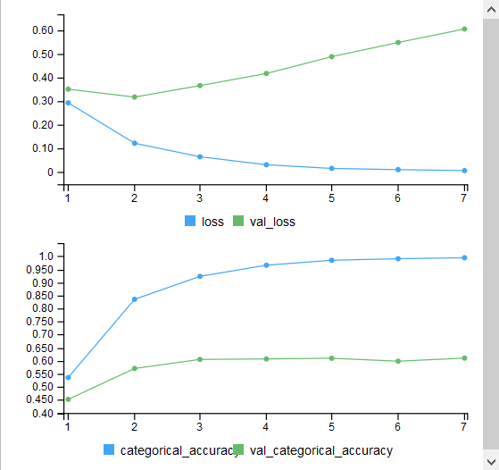

```{r, warning=FALSE, echo=FALSE,eval=FALSE}


##########Librabrys
require(keras, quietly = TRUE)
require(dplyr, quietly = TRUE)
require(tidytext, quietly = TRUE)

#####LoadData
load("input_data.RData")
load("balanced_train_data.RData")
load("sentence_data.RData")


### Calculate distinct number of words in corpus
max_words = as.numeric(input_data$words %>% select(word) %>% unique() %>% count())
#max_words
max_length= as.numeric(as.matrix(input_data$words %>% group_by(id) %>% summarise(n = n()) %>% arrange(desc(n)))[1,2])
#max_length
min_length= as.numeric(as.matrix(input_data$words %>% group_by(id) %>% summarise(n = n()) %>% arrange((n)))[1,2])
#min_length


# Extract sentences and presidents
sentences = input_data$sentences %>% select(sentence) %>% unlist()
presidents = input_data$presidents %>% unlist()

# Fit input tokenizer
tokenizer = keras::text_tokenizer(num_words = max_words)
tokenizer$fit_on_texts(sentences)

# Fit president tokenizer
president_count = presidents %>% as_tibble() %>% unique() %>% count()
response_tokenizer = text_tokenizer(num_words = president_count + 1)
response_tokenizer$fit_on_texts(presidents)

tokenize_data = function(data_list) {
  # Filter out short sentences
  filtered_list = (data_list %>% filter(stringi::stri_length(sentence) > min_length))
  
  # Convert sentences to matrix of input vectors
  sequences = tokenizer$texts_to_sequences(filtered_list$sentence)
  x_data = pad_sequences(sequences, max_length, padding = "pre", truncating = "pre")
  
  # One-hot encode president
  # Extract response vector, ignoring first (empty) column
  y_data = (response_tokenizer$texts_to_matrix(filtered_list$president, mode = "binary"))[,-1]
  
  return (list(x = x_data, y = y_data))
}

# Transform test and validation sets
train = tokenize_data(balanced_train_data)
validate = tokenize_data(sentence_data$validate)


#######Get the validation data out
#not sure why but the model fit didn't like the "$" reference
val_x <- validate$x
val_y <- validate$y

############################
#FEATURES OF NN
##########################
max_features <- max_words
maxlen <- max_length
batch_size <- 32
embedding_dims <- 70
filters <- 250
kernel_size <- 3
hidden_dims <- 250
epochs <- 10


###############################
##Model!!
################################
model_attempt <- keras_model_sequential()

model_attempt %>% 
  # Start off with an efficient embedding layer which maps
  # the vocab indices into embedding_dims dimensions
  layer_embedding(max_features, embedding_dims, input_length = maxlen) %>%
  layer_dropout(0.2) %>%
  
  # Add a Convolution1D, which will learn filters
  # Word group filters of size filter_length:
  layer_conv_1d(
    filters, kernel_size, 
    padding = "valid", activation = "relu", strides = 1
  ) %>%
  # Apply max pooling:
  layer_global_max_pooling_1d() %>%
  
  # Add a vanilla hidden layer:
  layer_dense(hidden_dims) %>%
  
  # Apply 20% layer dropout
  layer_dropout(0.2) %>%
  layer_activation("relu") %>%
  
  # Project onto a 6 unit output layer, and a softmax to push into output layer
  
  layer_dense(president_count) %>%
  layer_activation("softmax")

# Compile model
model_attempt %>% compile(
  loss = "binary_crossentropy",
  optimizer = "adam",
  metrics = "categorical_accuracy"
)

# Training ----------------------------------------------------------------

model_attempt %>%
  fit(
    train$x, train$y,
    batch_size = batch_size,
    epochs = 7,
    validation_data = list(val_x, val_y)
  )


######################################
#Sumamry of model
######################################
model_attempt

########Look at export
##This is just me trying to see if its actucally predicting

predictions <- model_attempt %>% predict_classes(val_x)

pres.actual <- as.data.frame(val_y)
pres.actual <- apply(val_y,1,which.max) 


predictions_val <- cbind(sentence_data$validate,predictions,pres.actual)
predictions_val$predictions <-  predictions_val$predictions + 1


##CHECKS
max(predictions_val$predictions)
min(predictions_val$predictions)

t <- table(predictions_val$pres.actual, predictions_val$predictions)
sum(diag(t))/sum(t)


#saveRDS(model_attempt, "simple_cnn.rds")


```

